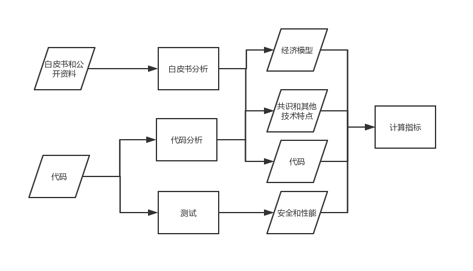
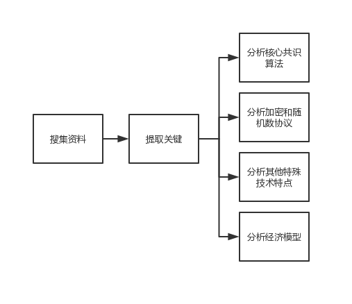
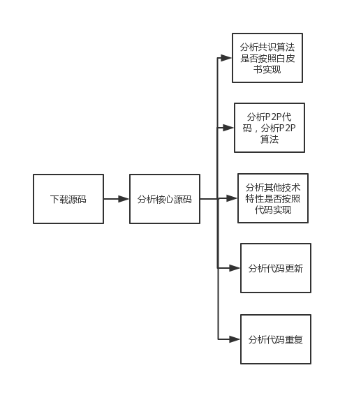
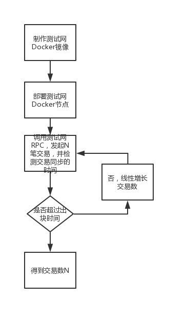
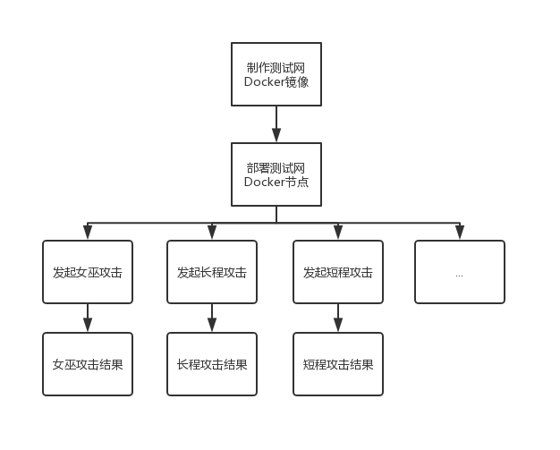

# Benchmark公告 :exclamation::exclamation::exclamation:
## TO-DO

- [Benchmark模板](rule/Benchmark_template/Benchmark_template.md)

## In-Progress

- [Benchmark社区规则](rule/Benchmark_rule/Benchmark_rule.md)

- [Benchmark技术黄皮书](result/Benchmark_yellowpaper_zh-cn/Benchmark_yellowpaper_zh-cn.md)

- [《Benchmark技术指南》](study/Benchmark_tech_study_zh-cn.md)

- [Benchmark术语表](result/Glossary/Glossary.md)

## Done

- [EVOLAB Benchmark技术尽调报告-Quark](https://mp.weixin.qq.com/s/GtMxlf8J8QdTiV2sZVTAPw)

- [EVOLAB Benchmark技术尽调报告-Tron](https://mp.weixin.qq.com/s/-NPpj73BCy381O4bwTcZ2A)

- [EVOLAB Benchmark技术尽调报告-Vechain](https://mp.weixin.qq.com/s/K5CPeWYLEECddRHXSAMQ2Q)

- [EVOLAB Benchmark技术尽调报告-Cardano](https://mp.weixin.qq.com/s/ghOmNEqo3o8eviQwWsqJqg)

- [EVOLAB Benchmark技术尽调报告-Zilliqa](https://mp.weixin.qq.com/s/_AmX1sd6ckiHIvsreOY_OQ)

# Benchmark是什么

> 贪婪，导致了许多项目在没有进行尽职调查的情况下轻松筹集了数百万美元 --《为何查理·芒格拒绝数字资产？》

为了让投资者透明化地了解一个区块链项目的技术情况，我们从共识、安全、性能、技术创新、代码和经济模型进行研究，推出了区块链项目的技术尽调报告EVOLAB Benchmark(下面简称"Benchmark")。

若有意见或想法，请向我们issue或者加入技术社区，非常感谢 :heart:

# Benchmark框架

### 白皮书分析

查看详情

### 代码分析

查看详情

### 性能测试

查看详情

### 安全测试

查看详情

# 怎样参与

:point_right:[《Benchmark社区规则》](rule/Benchmark_rule/Benchmark_rule.md)

# 奖励名单

:trophy: [奖励名单](rule/Benchmark_reward_list/Benchmark_reward_list.md)

欢迎大家一起来玩耍:dancers:

# 学习资料

- [《Benchmark技术指南》](study/Benchmark_tech_study_zh-cn.md)
