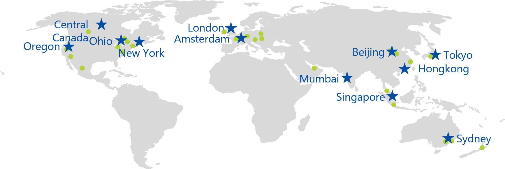
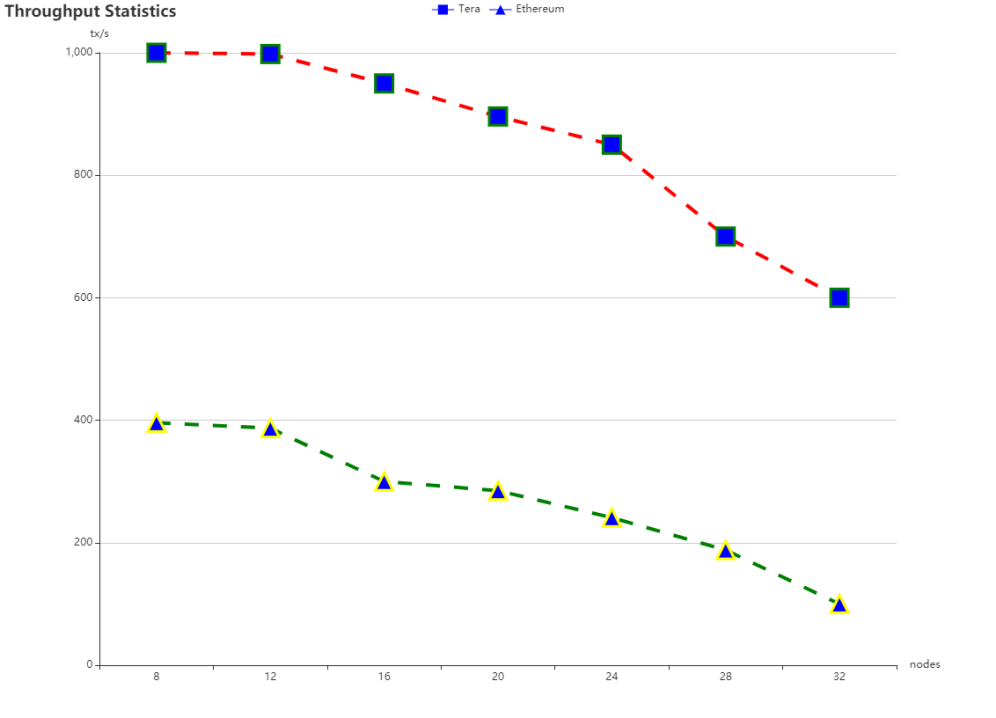
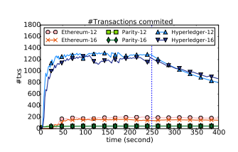
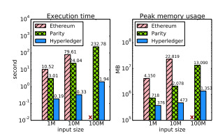

Benchmark evaluation framework

System quality assessment
=========================

The Benchmark common benchmarking framework is used for the quantitative
analysis of the blockchain data processing platform. The benchmark is based on a
blockchain system with a complete smart contract.

1.  Scoring layer

Benchmark abstracts the blockchain system into six levels according to the logic
of the blockchain software stack [1, 2].

### 1.1 Application layer

Contains blockchain application classes, such as smart contracts.

### 1.2 Incentive layer

The distribution mechanism of the certificate is whether the economic model of
the system is reasonable.

### 1.3 Execution Engine Layer

Includes details of the runtime environment in which smart contracts are
executed, such as compilers, virtual machines, dockers, and more.

### 1.4 Consensus algorithm layer

The role of the consensus layer is to make all nodes in the system agree on the
contents of the blockchain.

### 1.5 Data layer

A chain structure containing a blockchain, a hash function, and the like.

### 1.6 Network layer

Contains the propagation mechanism of the blockchain, the verification
mechanism, and so on.

Workload
========

Benchmark will provide benchmark workloads for evaluating the application layer,
execution engine layer, data layer, and consensus algorithm layer.

### 2.1 Application layer benchmark workload

Database workload:

YCSB: Widely used to evaluate NoSQL databases, for which Benchmark will
implement a simple key-value pair to store smart contracts. The load client
loads a certain number of records into each store based on the YCSB driver and
supports requests with different read and write ratios.

Smallbank: A popular benchmark load for OLTP applications, Benchmark will
transfer funds from one account to another through smart contracts.

Other workloads:

EtherId: A popular domain name registration smart contract.

Doubler: Pyramid sales smart contract.

WavesPresale: A smart contract for token sales through crowdfunding.

### 2.2 Execution Engine Layer Benchmark Workload

CPUHeavy: Evaluate the computational efficiency of the execution engine layer by
implementing a quick sort algorithm on a large array with smart contracts.

### 2.3 Data layer benchmark workload

Analytics: An OLAP-like workload. Mainly perform queries like scan and
aggregate.

Q1: Calculate the sum of the number of transactions confirmed between block i
and block j.

Q2: Calculate the transaction containing the maximum transaction value between
block i and block j under the qualification (designated account).

IOHeavy: Focus on disk storage performance. The IO performance of the blockchain
is evaluated by calling a smart contract that performs a large number of local
state random writes and random reads.

### 2.4 Consensus Algorithm Layer Benchmark Workload

DoNothing: Smart contracts accept transactions as input and simply return. Only
the minimum operands of the execution layer and the data model layer are
triggered during contract execution, so the overall performance will be
determined by the efficiency of the consensus algorithm layer.

Evaluation implementation
=========================

Benchmark will use some benchmark workload as input and send transactions to the
blockchain system based on a user-defined configuration. Benchmark collects and
displays runtime statistics.

### 3.1 Lab environment

The nodes are deployed in different regions around the world, including
Amsterdam, London, New York, Mumbai, Singapore, Tokyo, Sidney, central Canada,
Oregon, north California, Ohio, north Virginia, Ireland, Frankfurt, Hong Kong,
Beijing and Shanghai, etc.

### 3.2 Application layer evaluation

#### 3.2.1 Throughput (Throughput)

The number of transactions successfully executed per second. A workload can be
configured with multiple clients, each client sending multiple requests to
ensure that the blockchain system is in a working saturated state.

Example: Under the baseline workload, test the Tera blockchain system for 5
minutes of peak performance on 8 server nodes and 8 concurrent clients. Two
benchline systems were selected: a traditional database system such as H-Store,
a well-known blockchain system with similar consensus mechanisms such as
Ethereum.

Test output sample

#### 3.2.2 Latency

The length of response for each transaction. During the evaluation process, it
will send a new transaction request after the previous transaction completes the
return structure.

Example: Under the baseline workload, test the Tera blockchain system for 5
minutes of peak performance on 8 server nodes and 8 concurrent clients. Select a
benchmarkline system: a well-known blockchain system such as Ethereum with
similar consensus mechanisms.

Test output sample

#### 3.2.3 Scalability

Changes in throughput and latency when increasing the number of nodes and the
number of concurrent workloads.

Example: Under the baseline workload YCSB, test the scalability of the Tera
blockchain system and the benchmarkline system on the same number of server
nodes and clients. Select a benchmarkline system: a well-known blockchain system
such as Ethereum with similar consensus mechanisms.

Specific methods: Gradually increase the number of nodes to see changes in
network throughput.

Test output sample

The delay test is similar to the above figure. The specific method is to
gradually increase the node and see the network delay change.

#### 3.2.4 Fault tolerance

Changes in throughput and latency during node failures. We simulate system
crashes, network delays, and random information corruption.

Example: In the case of providing 8 concurrent clients, let the system run 12
and 16 server nodes for more than 5 minutes respectively. In the 250s, the 4
server nodes are manually closed. View throughput performance changes. Choose a
benchmark.

#### 3.2.5 Security (security)

The ratio between the total number of blocks contained in the primary branch and
the total number of confirmed blocks. The lower the ratio, the less likely the
system is to be affected by double pay or private mining.

Example: In the environment of 8 concurrent clients and 8 server nodes, create a
network partition in the 100s for 150s, and set the partition size to half of
the original network. Observe the ratio of the number of blocks agreed to reach
the total number of blocks. Choose a benchmark.

The blockchain caused by the attack is forked. At the 100s, the network is
divided into two parts and lasts for 150s. \*-total represents the total number
of blocks generated in the blockchain \*, and \*-bc represents the total number
of blocks agreed upon in the blockchain \*.

Can add various types of attacks, such as: witch attacks, long-range /
short-range attacks, DDos attacks, overflow attacks, etc.

### 3.3 Incentive layer evaluation

The design of an excellent certificate economy model is the soul of a blockchain
project.

Since there is no absolute quantitative standard for the CIS model, we will
provide readers with an explanation of the economic model only in an analytical
manner. It mainly includes user role analysis, analysis of the application
environment of the certificate, and analysis of the distribution method of the
certificate.

#### 3.3.1 User Role Analysis

Participants in the Compulsory Economic System will include multiple roles, and
we will define these user roles from the perspective of all parties' claims.

#### 3.3.2 Analysis of application scenarios

The current blockchain project market is mixed, and many projects only use the
name of the blockchain, which is actually arbitrage. Therefore, the application
scenario of the pass will be an important part of identifying the quality of a
blockchain project.

#### 3.3.3 Analysis of the distribution method of the pass

In the macro economy, there are three distribution theories under the conditions
of market economy: the first is the distribution according to the efficiency
principle of the market; the second is the government pays attention to the
principle of fairness and efficiency, focuses on the principle of fairness, and
adopts taxes and social security expenditures. Redistribution by means of other
means; the third is the distribution of voluntary contributions by individuals,
driven by moral power [3].

The above theory is equally applicable to the pass-through economy. The
difference is that the pass-through economy will increase the initial
distribution problem after the pass, ie:

**First allocation:** The way in which the certificate is generated, after the
generation, is distributed from the creation zone to the original holder. For
example, the initial purchase of PoS is obtained by Token, and the pre-mining of
PoW is obtained by Token.

**Second allocation:** In its own ecological use scenario, the way in which the
certificate is distributed (eg by contribution) is secondarily distributed. For
example, some PoS blockchains are re-acquired by Token pledge, PoW Excavation in
addition to pre-excavation to obtain Token.

**Third allocation:** If there is a governance mechanism, how to manage the pass
held by the user (such as the partial destruction of the transfer fee), and in
what way (such as the node currency encourages the lock) The liquidity of the
certificate.

**Fourth allocation:** personal donations, rewards, etc. between users.

### 3.4 Execution Engine Level Assessment

Start a client and a server node.

Example: Deploy a baseline workload CPUHeavy smart contract. The contract uses a
quick sort algorithm to sort the arrays, input 1M, 10M, and 100M data,
respectively, to measure execution time and server memory peak usage. Choose a
benchmark: Ethereum with similar consensus algorithms.

### 3.5 Consensus Algorithm Layer Evaluation

Example: In the case of 8 concurrent clients and 8 server nodes, deploy a
DoNothing smart contract that accepts transaction requests and returns
immediately. And compared with the throughput of YCSB and Smallbank. The portion
of DoNothing throughput that is greater than other baseline workloads, which is
the overhead of other benchmark workload transactions. For example, the
throughput of DoNothing in Ehereum is 10% higher than YCSB, which means that the
execution of YCSB transactions accounts for 10% of the overhead.

### 3.6 Data layer evaluation

Start a client and a server node.

Example: Deploy a baseline workload IOHeavy smart contract. The contract
performs read and write operations on some key tuples. For example, input 0.8M,
1.6M, 3.2M, 6.4M, 12.8M tuples to record the throughput of read and write
operations and disk usage.

Example: Analytics workload (optional)

Q1: Calculate the sum of the number of transactions confirmed between block i
and block j.

Q2: Calculate the transaction containing the maximum transaction value between
block i and block j under the qualification (designated account).

Each system initializes 120,000 accounts and each account has a fixed balance.
Subsequently, transactions are initiated between accounts, loaded into 100,000
blocks, and each block contains an average of 3 transactions, each transaction
transferring one value from one random account to another. Finally, the above
two queries Q1 and Q2 are executed, and the execution time is recorded.

### 3.7 Network layer evaluation

Benchmark will conduct a security test on the network layer of the blockchain
system according to the category of the consensus algorithm. The test items
include:

**PoW/PoS:** 51% attack, priority mining, long-range attack, short-range attack,
etc.

**BFT:**Election process security test, DDoS attack, etc.

Code evaluation
===============

2.1 Check the weight
--------------------

Code repetition is the degree of similarity between the test project and the
well-known project. First, index the elasticsearch, use existing and well-known
projects as the standard, and then compare the code structure, keywords and logo
words, and finally get similar files. number.

2.2 Modularity
--------------

The blockchain project belongs to a class of projects with frequent system
upgrades. The modular design level of the technical architecture represents the
scalability of R&D to a certain extent. At the same time, the lower the module,
the more stable it should be, and the higher the degree of reusability. We will
consider the technical architecture is clear, code coupling and other aspects.

Ecological assessment
=====================

The number of Dapps, Dapp types, etc.

References:
-----------

[1]<https://www.comp.nus.edu.sg/~ooibc/blockbench.pdf>

[2]<https://www.meti.go.jp/english/press/2017/pdf/0329_004a.pdf>

[3]<https://wiki.mbalib.com/wiki/%E4%B8%89%E6%AC%A1%E5%88%86%E9%85%8D%E7%90%86%E8%AE%BA>
