Benchmark测试框架

系统质量测评
============

Benchmark通用基准测试框架用于区块链数据处理平台的定量分析，测评标的以带有完整智能合约的区块链系统为主。

1.测评分层
----------

Benchmark根据区块链软件栈的逻辑性将区块链系统抽象为6个层次[1,2]。

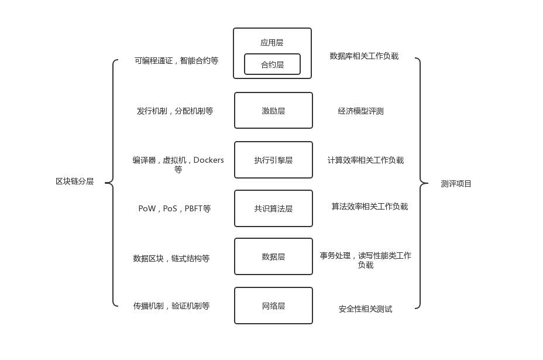

### 1.1应用层

包含区块链应用程序类，如智能合约等。

### 1.2激励层

通证的分发机制即系统的经济模型是否合理。

### 1.3执行引擎层

包括执行智能合约的运行环境细节，如编译器、虚拟机、docker等。

### 1.4共识算法层

共识层的作用是使系统中的所有节点对区块链内容达成一致。

### 1.5数据层

包含区块链的链式结构、哈希函数等。

### 1.6网络层

包含区块链的传播机制、验证机制等。

2.工作负载
----------

Benchmark将提供用于评估应用层、执行引擎层、数据层和共识算法层的基准工作负载。

### 2.1应用层基准工作负载

数据库工作负载：

YCSB：广泛用于评估NoSQL数据库，为此BENCHMARK将对应实现一个简单的键值对存储智能合约。负载客户端基于YCSB驱动程序将一定数量的记录加载到每个存储，并支持具有不同读写比率的请求。

Smallbank：OLTP应用的一个流行基准负载，BENCHMARK将通过智能合约实现将资金从一个账户转移到另一个账户。

其他工作负载：

EtherId：一个流行的域名注册智能合约。

Doubler：金字塔销售智能合约。

WavesPresale：通过众筹形式实现代币销售的智能合约。

### 2.2执行引擎层基准工作负载

CPUHeavy：通过智能合约实现在一个大数组上的快速排序算法来评测执行引擎层的计算效率。

### 2.3数据层基准工作负载

Analytics：类似OLAP的工作负载。主要执行类似scan和aggregate的查询。

Q1:计算区块i和区块j之间确认的事务数量总和。

Q2:计算限定条件（指定账户）下区块i和区块j之间包含最大交易值的事务。

IOHeavy：关注磁盘存储性能。通过调用执行大量本地状态随机写入和随机读取到的智能合约来评估区块链的IO性能。

### 2.4共识算法层基准工作负载

DoNothing：智能合约接受事务作为输入，并简单地返回。合约执行过程中只触发执行层和数据模型层的最小操作数，因此整体性能将由共识算法层的效率决定。

3.测评实现
----------

BENCHMARK将会采用一些基准工作负载作为输入，并根据用户定义的配置将事务发送到区块链系统。BENCHMARK会收集运行时的统计数据并予以展示。

### 3.1实验环境

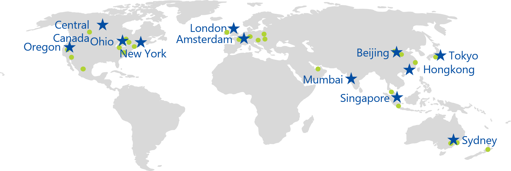

Benchmark节点分布在阿姆斯特丹、伦敦、纽约、孟买、新加坡、东京、悉尼、加拿大中部、俄勒冈、加尼福尼亚北部、俄亥俄、弗吉尼亚北部、爱尔兰、法兰克福、香港、北京、上海等不同区域。

### 3.2应用层测评

#### 3.2.1吞吐量（Throughput）

每秒成功执行的事务数量。一个工作负载可以配置多个客户端，每个客户端多线程发送请求，保证区块链系统处于工作饱和状态。

示例：在基准工作负载下，测试Tera区块链系统在8个服务器节点和8个并发客户端运行5分钟的峰值性能。选定两个benchline系统：一个传统数据库系统如H-Store，一个共识机制相近的知名区块链系统如Ethereum。测试输出样图:

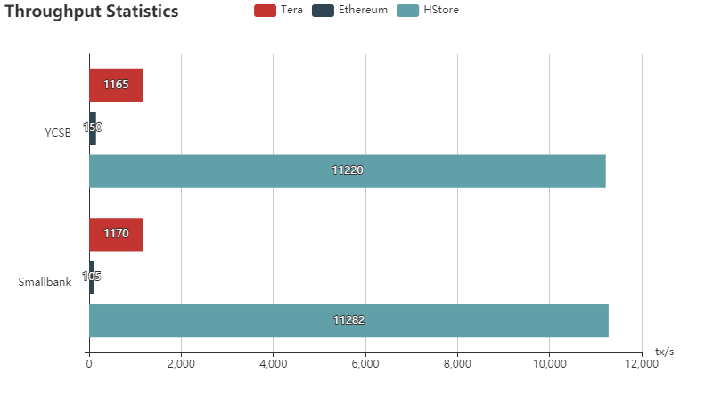

#### 3.2.2延迟（Latency）

每个事务处理的反应时长。在评测过程中，在上一个事务处理完成返回结构之后，它才会发送新的事务请求。

示例：在基准工作负载下，测试Tera区块链系统在8个服务器节点和8个并发客户端运行5分钟的峰值性能。选定一个benchline系统：如共识机制相近的知名区块链系统如Ethereum。测试输出样图:

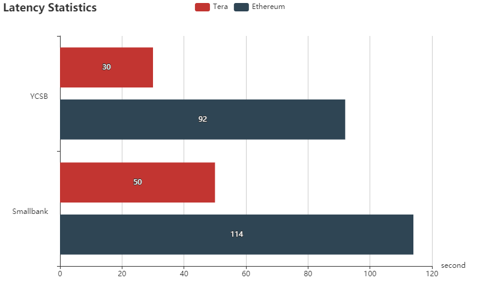

#### 3.2.3扩展性（scalability）

当增加节点数量和并发工作负载数量时，吞吐量和延迟的变化。

示例：在基准工作负载YCSB下，测试Tera区块链系统与benchline系统在相同数量服务器节点和客户端的扩展性。选定一个benchline系统：如共识机制相近的知名区块链系统如Ethereum。

具体方法：逐步增加节点，看网络吞吐量变化。测试输出样图:

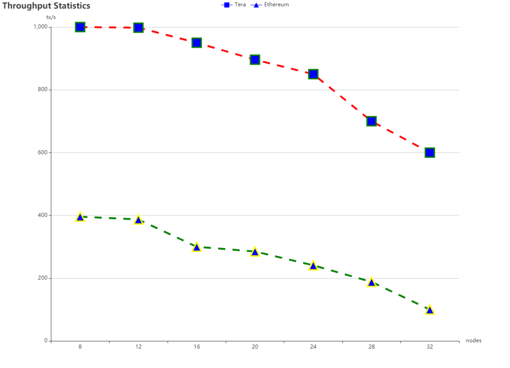

延迟测试与上图类似，具体方法：逐步增加节点，看网络延迟变化。

#### 3.2.4容错性（fault tolerance）

在节点故障期间，吞吐量和延迟的变化。我们模拟系统崩溃、网络延迟和随机的信息损毁。

示例：在提供8个并发客户端的情形下，分别让系统运行12个和16个服务器节点超过5分钟。在第250s，人工关闭4个服务器节点。查看吞吐量性能变化。选择一个benchline。

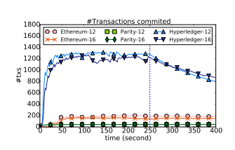

#### 3.2.5安全性（security）

主分支中包含的区块总数与确认区块的总数之间的比率。比率越低，系统就越不容易受到注入双重支付或私自挖矿的影响。

示例：在8个并发客户端和8个服务器节点环境下，在第100s内创建网络分区，持续150s，将分区大小设为原有网络的一半。观察达成一致的区块数量占总区块数量的比例。选择一个benchline。

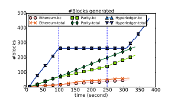

由攻击造成的区块链分叉，在第100s开始将网络分为两部分，并持续150s。total表示在区块链中生成的区块总数，bc表示在区块链中达成一致的区块总数。

可添加各类攻击，如：女巫攻击，长程/短程攻击，DDos攻击，溢出攻击等

### 3.3激励层测评

优秀的通证经济模型设计是一个区块链项目的灵魂所在。

由于通证经济模型没有绝对的量化标准，所以我们将仅以剖析的方式为读者提供经济模型的解读。主要包括用户角色解析，通证应用场景解析以及通证分配方式解析等。

#### 3.3.1用户角色解析

通证经济系统的参与者将包括多种角色，我们将从各方诉求角度界定这些用户角色。

#### 3.3.2通证应用场景解析

当前区块链项目市场鱼龙混杂，许多项目仅仅套用区块链之名，实为套利圈钱。故通证的应用场景将是鉴别一个区块链项目质量好坏的重要部分。

#### 3.3.3通证分配方式解析

宏观经济中存在市场经济条件下的三次分配理论：第一次是由市场按照效率原则进行的分配；第二次是由政府按照兼顾公平和效率的原则、侧重公平原则，通过税收、社会保障支出等手段进行的再分配；第三次是在道德力量的推动下，通过个人自愿捐赠而进行的分配[3]。

上述理论同样适用于通证经济，所不同的是，通证经济将增加通证产生后的初次分配问题，即：

**第一次分配：**通证的产生方式，产生后以何种方式从创世区块分配给最初持有者，如PoS的初始申购获得Token，PoW的预挖矿获得Token。

**第二次分配：**在其自有生态使用场景中，通证以何种方式（如按贡献）进行二次分配，如某些PoS区块链以Token质押方式再获得Token，PoW除预挖外的挖矿获得Token。

**第三次分配：**若存在治理机制，通过何种方式管理用户所持有的通证（如转账手续费部分销毁等），又以何种方式（如节点币鼓励锁仓）影响通证的流动性。

**第四次分配：**用户间的个人捐赠、打赏等。

### 3.4执行引擎层测评

启功一个客户端和一台服务器节点。

示例：部署基准工作负载CPUHeavy智能合约。合约使用快速排序算法对数组进行排序，分别输入1M,10M,100M数据，测量执行时间和服务器内存峰值使用情况。选择一个benchline:如共识算法相近的Ethereum。

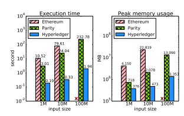

### 3.5共识算法层测评

示例：在8个并发客户端和8个服务器节点的情形下，部署接受事务请求并立即返回的DoNothing智能合约。并与YCSB和Smallbank的吞吐量进行比较。DoNothing吞吐量比其他基准工作负载增加的部分，即为其他基准工作负载事务执行所占的开销。比如，Ehereum中DoNothing的吞吐量比YCSB增加了10%，这意味着YCSB事务的执行占了10%的开销。

### 3.6数据层测评

启动一个客户端和一台服务器节点。

示例：部署基准工作负载IOHeavy智能合约。合约执行一些键值元组的读和写操作。如分别输入0.8M，1.6M,3.2M,6.4M,12.8M个元组，记录读写操作的吞吐量和磁盘使用情况。

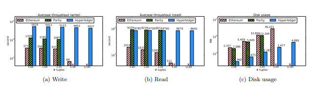

示例：Analytics工作负载（可选）

Q1:计算区块i和区块j之间确认的事务数量总和。

Q2:计算限定条件（指定账户）下区块i和区块j之间包含最大交易值的事务。

每个系统初始化12万个账户，并且每个账户都有一个固定的余额。随后，账户间发起交易，将它们装入10万个块，平均每个区块包含3个事务，每个事务将一个值从一个随机账户转移到另一个随机账户。最后执行上述Q1和Q2两个查询，记录执行时间。

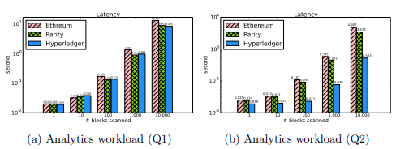

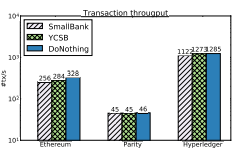

### 3.7网络层测评

BENCHMARK将依据共识算法的类别对区块链系统网络层进行安全性测试，测试项目包括：

**PoW/PoS:**51%攻击、优先挖矿、长程攻击、短程攻击等

**BFT:**选举过程安全性测试、DDoS攻击等

代码测评
========

2.1查重
-------

代码重复度是比较测试项目和知名项目的代码相似程度，首先在elasticsearch建立索引，以已有的、知名的项目作为标准，然后比较其代码结构、关键字和标志词是否类似，最后得到相似文件数。

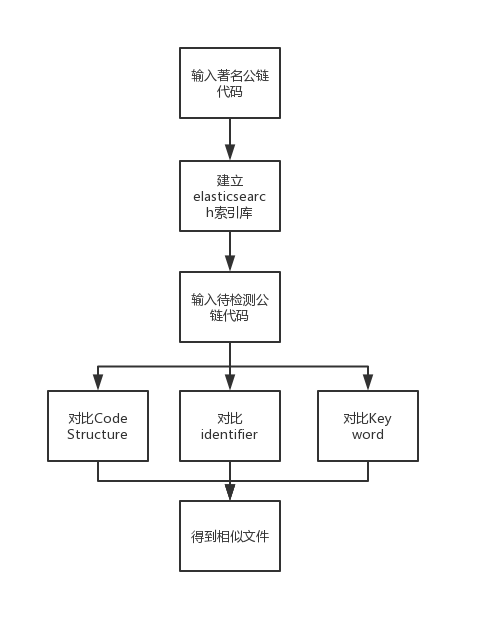

2.2模块化程度
-------------

区块链项目属于系统升级频繁一类项目，技术架构的模块化设计水平一定程度上代表了研发的可延展性。同时越底层模块，应该越稳定，越具有高复用度。我们将从技术架构是否清晰、代码耦合度等方面进行考量。

生态测评
========

Dapp数量，Dapp种类等。

参考文献:
---------

[1]<https://www.comp.nus.edu.sg/~ooibc/blockbench.pdf>

[2]<https://www.meti.go.jp/english/press/2017/pdf/0329_004a.pdf>

[3]<https://wiki.mbalib.com/wiki/%E4%B8%89%E6%AC%A1%E5%88%86%E9%85%8D%E7%90%86%E8%AE%BA>
