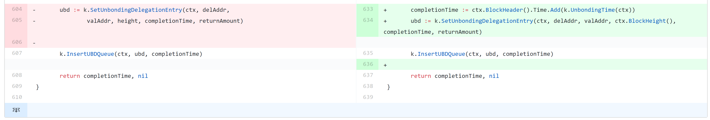

一、 概述
---------

Cosmos 是一个独立平行的区块链网络，其中每条区块链通过 Tendermint这样的经典拜占庭容错共识算法来运行。由许多被称之为“分区”的独立区块链组成的网络。分区在Tendermint Core 的支持下运行，Tendermint Core是一个类似拜占庭容错安全共识引擎。使用其他共识模型的区块链网络也能够通过适配分区，连接到Cosmos网络中。

Cosmos 的第一个分区称之为Cosmos枢纽（Cosmos Hub）。Cosmos 枢纽能够通过链接其他的分区，实现扩展。据白皮书描述，Cosmos可以实现区块链之间的互操作，代币可以快速安全的在分区间流动，实现跨链资产的无缝转移和交易。


二、分析
--------

### (一) 测试说明


### (二) 共识

Tendermint 是部分同步运作的拜占庭容错共识协议，以简易型、高性能以及分叉问责制而著称。 拜占庭容错股份授权证明机制(Tendermint-BFT DPoS)的共识过程分为投票阶段及提交阶段。一个选票可以用于特定区块或Nil。将同一轮超过⅔的单个区块的预投票总和称为Polka，把同一轮超过⅔的单个区块的预提交总和称为Commit。如果同一轮针对Nil的预提交超过⅔，那么它们就进入下一轮。每一轮剩下的进程是完全同步的，在过程中只有验证人收到超过⅔的网络投票才会进入下一步。
另一个约束规则，即确保最终在每个高度只提交一个区块，任何试图提交超过一个区块到指定高度的恶意行为都会被识别出来。

1、每个区块的预提交必须正当，并且以Polka的形式提交。如果验证人已经在R_1轮预提交了一个区块，那么我们就认为它们被锁定在了这个区块，然后用于验证R_2轮新预提交动作的Polka必须进入R_polka轮，其中R_1 < R_polka <= R_2。
2、验证人必须提出并且/或者预投票它们被锁定的区块。确保验证人不会在没有充足证据证明正当性的前提下进行预提交，并且保证已经完成预提交的验证人不能再为其他东西的预提交贡献证明。

这两步合起来，不但可以保证安全，还能保证共识算法的活跃。据白皮书描述，Tendermint轻客戸端可以定期同步验证组的变动，以避免出现远距离攻击。

###  (三) 安全
**1.COSMOS逻辑漏洞分析**  
2019年五月三十一日COSMOS爆出重大漏洞，该团队迅速反应，对[bug(commit history)](https://github.com/cosmos/cosmos-sdk/commit/80234baf91a15dd9a7df8dca38677b66b8d148c1?diff=unified)进行了修复。本部分主要是对此重大漏洞进行解析。  
首先解释几个与漏洞相关的tendermint中的重要概念。  
Atom是Cosmos Hub的原生代币。Atom的核心效用是作为一个权益抵押机制来确保Hub在权益证明过程中起到押金作用。借用工作量证明的挖矿操作做比喻，你可以将Atom视为一种虚拟化的ASIC。每个验证人抵押的Atom将决定它被选为出块人的频率和在提交区块投票时的权重。为了激励大家都抵押持有的Atom，每个验证人可以获得相应的出块奖励、抵押获利和白名单上的手续费。
Cosmos Hub的委托人是Atom的持有者。他们通过委托Atom来保护Cosmos网络的安全。抵押Atom时没有最小数量的要求。具体的途径是他们通过选择委托给一个或多个验证者，验证人将获得委托人的投票权重。如果验证者行为不当（例如，在同一个区块高度签署两个不同的区块），那么有错误行为的验证者和委托者抵押的部分抵押代币都将会被罚没一部分。作为回报，委托人可以获得一定比例的交易费用和区块奖励。
官方文档中Validator的具体结构如下
```go
type Validator struct {
    OperatorAddr    sdk.ValAddress // address of the validator's operator; bech encoded in JSON
    ConsPubKey      crypto.PubKey  // Tendermint consensus pubkey of validator
    Jailed          bool           // has the validator been jailed?

    Status          sdk.BondStatus // validator status (bonded/unbonding/unbonded)
    Tokens          sdk.Int        // delegated tokens (incl. self-delegation)
    DelegatorShares sdk.Dec        // total shares issued to a validator's delegators

    Description Description  // description terms for the validator

    // Needed for ordering vals in the by-power key
    UnbondingHeight  int64     // if unbonding, height at which this validator has begun unbonding
    UnbondingMinTime time.Time // if unbonding, min time for the validator to complete unbonding

    Commission Commission // info about the validator's commission
}
```
可以看到Validator主要的status有三种：bonded/unbonding/unbonded
[COSMOS中对Validator状态变化的说明](https://cosmos.network/docs/spec/staking/02_state_transitions.html#state-transitions)如下：  
### Validators
***    
### `Non-Bonded to Bonded`
When a validator is bonded from any other state the following operations occur:

* set validator.Status to Bonded
* update the Pool object with tokens moved from NotBondedTokens to BondedTokens
* delete record the existing record from ValidatorByPowerIndex
* add an new updated record to the ValidatorByPowerIndex
* update the Validator object for this validator
* if it exists, delete any ValidatorQueue record for this validator
### `Bonded to Unbonding`
When a validator begins the unbonding process the following operations occur:  
* update the Pool object with tokens moved from BondedTokens to NotBondedTokens
* set validator.Status to Unbonding
* delete record the existing record from ValidatorByPowerIndex
* add an new updated record to the ValidatorByPowerIndex
* update the Validator object for this validator
* insert a new record into the ValidatorQueue for this validator
#### `Unbonding to Unbonded`
A validator moves from unbonding to unbonded when the ValidatorQueue object moves from bonded to unbonded

* update the Validator object for this validator
* set validator.Status to Unbonded  

简单地说，验证者的状态存在着由non-bonded->bonded->unbonding->unbonded 这样的转换过程。 同样，[委托者也存在着一定的状态转换](https://cosmos.network/docs/spec/staking/02_state_transitions.html#state-transitions)对该状态转换的总结如下：token的持有者可以将自己的token委托给验证者进行抵押以获取收益，验证者在bonded状态下开始接受收益。之后，委托者若想要赎回委托（undelegate），Validator需要退出bonded状态并进入unbonding状态，此时委托者才能进行unbondingdelegation。  
处于 unbonding 状态的验证者，当用户赎回时间 21 天（锁仓期）到期之后，将进入到 unbonded 状态，此时委托者接收到之前抵押的 Atom 及抵押期间的收益。并且，委托者可以进行redelegation操作重新进入委托状态。  
为了让大家能够更加直观清晰地对状态转换以及锁仓时间有所了解，下面给出了图例。  
  
从设计流程上进行分析，项目不存在可疑之处，但是在实际的代码中，出现的严重的逻辑错误，导致委托者可以减少锁仓期时间，提前赎回token。  
下面对项目中的具体出现逻辑错误的代码进行分析。
这是未修改前的Undelegate函数
```go
func (k Keeper) Undelegate(ctx sdk.Context, delAddr sdk.AccAddress,
	valAddr sdk.ValAddress, sharesAmount sdk.Dec) (completionTime time.Time, sdkErr sdk.Error) {

	// create the unbonding delegation
	completionTime, height, completeNow := k.getBeginInfo(ctx, valAddr)

	returnAmount, err := k.unbond(ctx, delAddr, valAddr, sharesAmount)
	if err != nil {
		return completionTime, err
	}
	balance := sdk.NewCoin(k.BondDenom(ctx), returnAmount)

	// no need to create the ubd object just complete now
	if completeNow {
		// track undelegation only when remaining or truncated shares are non-zero
		if !balance.IsZero() {
			if _, err := k.bankKeeper.UndelegateCoins(ctx, delAddr, sdk.Coins{balance}); err != nil {
				return completionTime, err
			}
		}

		return completionTime, nil
	}

	if k.HasMaxUnbondingDelegationEntries(ctx, delAddr, valAddr) {
		return time.Time{}, types.ErrMaxUnbondingDelegationEntries(k.Codespace())
	}

	ubd := k.SetUnbondingDelegationEntry(ctx, delAddr,
		valAddr, height, completionTime, returnAmount)

	k.InsertUBDQueue(ctx, ubd, completionTime)
	return completionTime, nil
}
```
可以看到在579行开始创建unbonding delegation，这里的completionTime使用了getBeginInfo中返回的时间。
```go
// get info for begin functions: completionTime and CreationHeight
func (k Keeper) getBeginInfo(ctx sdk.Context, valSrcAddr sdk.ValAddress) (
	completionTime time.Time, height int64, completeNow bool) {

	validator, found := k.GetValidator(ctx, valSrcAddr)

	switch {
	// TODO: when would the validator not be found?
	case !found || validator.Status == sdk.Bonded:

		// the longest wait - just unbonding period from now
		completionTime = ctx.BlockHeader().Time.Add(k.UnbondingTime(ctx))
		height = ctx.BlockHeight()
		return completionTime, height, false

	case validator.Status == sdk.Unbonded:
		return completionTime, height, true

	case validator.Status == sdk.Unbonding:
		completionTime = validator.UnbondingCompletionTime
		height = validator.UnbondingHeight
		return completionTime, height, false

	default:
		panic("unknown validator status")
	}
}
```
我们可以发现completionTime实际上是验证者unbond的开始时间。
然而，Undelegate函数是委托者的操作，在604行中ubd := k.SetUnbondingDelegationEntry(ctx, delAddr,valAddr, height, completionTime, returnAmount) ，使用了验证者的锁仓到期时间，并添加到UBD(UnbondingDelegation)队列中。这样导致的直接后果就是，委托者可以在验证者锁仓时间到期时同时赎回自己抵押的代币（验证者从bonded到unbonding的转换也需要一定时间周期一般情况下是七天左右，总体锁仓时间为21天）。
这个逻辑错误严重破坏了其他委托人和验证者的公平体验，同时也严重破坏了COSMOS的共识机制，因为委托人的赎回周期可以通过这个逻辑错误得到缩短。好在COSMOS团队及时对漏洞进行了响应并进行修复，上线了新版本。

下面对修复后的代码进行review。  


我们可以看到，为了解决这个逻辑错误，实际上只需要保证委托人在insertUBDQueue时所使用的completionTime参数为从当前时间算起的锁仓时间结束之后，而不是从验证者unbond时间开始。  
**2.COSMOS整体安全性评估**  
根据我们对COSMOS项目的调查分析，并且参考[其他研究者对COSMOS项目的研究工作](https://bubowerks.io/blog/2018/08/03/risk-assessment-of-cosmos-tendermint-validators/)\([中文翻译](https://medium.com/irisnet-blog/%E5%85%B3%E4%BA%8Ecosmos-tendermint%E9%AA%8C%E8%AF%81%E4%BA%BA%E7%9A%84%E9%A3%8E%E9%99%A9%E5%88%86%E6%9E%90-e1aa90f1545)\)，我们对COSMOS项目的特性进行了安全性评估。
主要威胁来源如下：
1)	哨兵系统或者辅助系统的连接被占用而受到损失: 验证人系统必须保证和哨兵系统和辅助系统连接。这种信任的连接可能会被攻破，然后将验证人节点暴露出来。尤其是一旦暴露了登陆链接信息，也就是如果攻击者可以用验证人的身份登陆，那么系统将处于危险之中。
2)	利用验证人系统或支持系统的利用信任链接造成的损害：对于验证人而言，哨兵节点可能暴露出系统漏洞。
3)	利用USB设备造成的损害：如果受感染的USB设备插入其中，则计算机可能会被恶意软件感染; 这在某些操作系统和桌面等系统中更为普遍，会有用户实际操作服务器。甚至对于隔离起来的服务器也有这个风险。
4)	利用MitM中间人攻击造成损害：原来只是在理论攻击领域和局域网概念证明，但最近的大规模重定向攻击已经证明复杂的攻击者能够将攻击导入到网络流量中。
5)	利用网络漏洞造成的损害：在现代主机上运行的各种服务 — 甚至在其正在运行的Tendermint特定服务之外 — 呈现出易受攻击的攻击面。 若网络软件中出现任何漏洞，攻击者必然会利用它。
6)	利用网络中的可信链接造成的损害：与其他网络漏洞一样，某些主机（如验证人节点）可能只能通过可信链接访问 — 即使有这种固有的架构保护，链路的另一端仍然可以利用该信任来攻击受保护的系统。
7)	利用钓鱼网站造成的损害：网络钓鱼可能是今天最成功，也就是普遍的攻击形式。 这通常涉及攻击者让目标进入攻击者控制的站点，但目标认为是合法的，并提供其凭据或其他受保护的信息。 还存在更复杂的形式，开始看起来更像是MitM攻击
8)	利用钓鱼网站陷阱造成的损害：基本网络钓鱼攻击的扩展，网络钓鱼漏洞是攻击者煽动目标进入网站的地方（例如通过使用耸人听闻的标题），这可能是恶意的，随后攻击目标的浏览器或插件（特别是 Java，Flash或PDF）并获得对攻击者计算机的控制权。
9)	由于赎金/勒索/贿赂导致的损害：这是内部人员滥用职权，切断（或威胁要）其他人访问资产并使用他们对资产的独家控制作为杠杆来获得他们想要的东西。
10)	由于供应链造成的损害：虽然供应链可能包括受损的硬件（例如替代恶意芯片），但现在真正关注的是软件供应链。 操作系统供应商，公用事业供应商，基础设施供应商和应用程序供应商都遭到黑客攻击 特别是如果针对特定系统或系统，攻击者可以轻松替换木马程序包，并且可能永远不会被注意到。
11)	由于Tendermint网络漏洞造成的损害：验证人节点和哨兵节点都需要运行Tendermint网络服务。任何Tendermint网络的漏洞都会被一个攻击者利用，无论是直接还是间接，无论是通过恶意交易，共识消息或是区块数据。
12)	由于网络漏洞而导致变为僵尸网络的损害：机会攻击者通常会通过将其添加到僵尸网络或将其控制权转移给所有者来通过他们对计算机的控制获利。 如果网络服务中存在任何已知漏洞，投机攻击者就会找到它们。
14)	由于钓鱼/钓鱼漏洞而导致变为僵尸网络的损害：如上文描述的，但是通过让用户访问受攻击者控制的站点而不是直接攻击网络服务来获得对机器的控制。 因为大多数服务器会使用防火墙，这是目前更为流行的方法。
15)	由于备用和支持系统的漏洞造成秘钥的暴露：即使秘钥没有丢失，任何在用和支持系统中暴露的秘钥将会带来安全威胁
17)	由于勒索而导致的损害：即使一个验证人的技术十分完美，它还是需要人来操作。任何由人控制的东西都会由于人的因素而变的脆弱。事实上，历史上大部分成功的攻击都是由于人为因素造成的：无论是钓鱼网站，集体作恶，还是 — 在极端情况下 — 敲诈勒索。 有许多涉及加密货币的抢劫案件 — 有理由认为，如果有足够大的吸引力，攻击者将诉诸勒索或身体暴力威胁来实现其目标。
21)	 由于代币持有人的钱包遭受攻击而造成的损失：Tendermint的安全机制以来验证人的权益抵押。如果一个验证人不能保证其委托的权益的安全，发生率例如钱包被攻击等事件，那么这就会造成委托人取回其委托权益，验证人可能导致丧失验证人的身份。这样会同时造成权益的损失和运维成本的损失。

24)	 由于DDoS造成的网络不可用的勒索：如今，许多DDoS攻击是由攻击者进行的，他们承诺如果支付赎金就结束DDoS。
25)	权益反转攻击:这是一种在PoS网络中新增的攻击类型，假设网络中存在一个有很多权益代币的持有者。这个持有者会抵押很多代币给他的验证人。当他想要让另一个候选人成为验证人的时候，他会收回委托给一些人的权益，再重新委托给其他人。Tendermint希望通过三周的解委托时长来限制这类操作，在这段期间不能再次委托。这样会限制一般的委托操作，但是不会限制一个很有很多代币的攻击者，他可能会加倍抵押权益来达到攻击的目的。这种攻击在持有2/3网络总代币的验证人身上起到作用，可以让攻击者在短时间内控制网络。更现实的是，如果控制了系统中1/3的权益，攻击者可以破坏系统共识。即使没有其他影响，攻击者也可以通过拖垮网络来剥夺验证人和委托人的收入。具体的分析在[这里](https://bubowerks.io/blog/2018/08/08/stake-flip-attack/)。
26)	在验证人节点运营结束后的代价：一般而言，验证人的运行不会突然结束，让启动验证人工作的代价成为沉没成本。但是，这也不是不可能的，若不幸遭遇了死亡、破产或者其他原因，一个运行验证人节点的公司可能会倒闭。当这个不幸发生的时候，它抵押的权益将被绑定三周，这可能带来一些损失。
27)	由于数据中心服务的不可用导致验证人服务的不可用:由于各种灾难，极端天气等事件，数据中心可能会不可用。例如Katrina和Sandy飓风都导致了大规模的数据中心断电，同时数据中心也可能被水淹没。极端天气的增多将增大这种不确定性。
28)	由于DDoS导致不可用：验证人若不能保证上线则会导致相应的惩罚。针对验证人的DDoS攻击或者针对其sentry和支持系统的DDoS攻击将导致很大的威胁。
29)	由于目标网络失效而导致的不可用：虽然DDoS攻击是将系统从互联网上隔离的最常用方式，但攻击者也可能使用更具针对性的网络中断，包括黑客流量或利用验证人网络硬件上的漏洞等手段。
30)	由于敲诈勒索而导致的撤销抵押：委托人可能会经常变动他们的委托。验证人控制的权益数量也会影响委托人的行为。如果委托人的委托占比很大，那么委托人可能会威胁验证人来满足他的需要。
我们为这些COSMOS中可能出现的威胁进行了等级评估 

| 威胁来源 | 类型 | 等级 |
| :------: | :------: | :------: |
| 哨兵系统或者辅助系统的连接被占用而受到损失 | 验证者系统 |<table><tr><td bgcolor=red>高危</td></tr></table> |
| 利用验证人系统或支持系统的利用信任链接造成的损害 | 验证者系统 |<table><tr><td bgcolor=red>高危</td></tr></table> |
| 利用USB设备造成的损害 | 验证者系统 |<table><tr><td bgcolor=green>低危</td></tr></table> |
| 利用MitM中间人攻击造成损害 | 其他系统 |<table><tr><td bgcolor=red>高危</td></tr></table> |
|利用网络漏洞造成的损害 | 所有系统 |<table><tr><td bgcolor=red>高危</td></tr></table> |
| 利用网络中的可信链接造成的损害 | 其他系统 |<table><tr><td bgcolor=red>高危</td></tr></table> |
| 利用钓鱼网站造成的损害 | 验证者密钥 |<table><tr><td bgcolor=red>高危</td></tr></table> |
| 由于赎金/勒索/贿赂导致的损害 | 验证者密钥 |<table><tr><td bgcolor=red>高危</td></tr></table> |
| 由于供应链造成的损害 | 验证者系统 |<table><tr><td bgcolor=red>高危</td></tr></table> |
| 由于Tendermint网络漏洞造成的损害 | 验证者系统 |<table><tr><td bgcolor=red>高危</td></tr></table> |
| 由于网络漏洞而导致变为僵尸网络的损害 | 所有系统 |<table><tr><td bgcolor=yellow>中危</td></tr></table> |
|由于钓鱼/钓鱼漏洞而导致变为僵尸网络的损害 | 所有系统 |<table><tr><td bgcolor=yellow>中危</td></tr></table> |
|由于备用和支持系统的漏洞造成秘钥的暴露| 验证者密钥 |<table><tr><td bgcolor=red>中危</td></tr></table> |
| 由于勒索而导致的损害| 验证者密钥 |<table><tr><td bgcolor=red>高危</td></tr></table> |
| 由于代币持有人的钱包遭受攻击而造成的损失 | 其他系统 |<table><tr><td bgcolor=yellow>中危</td></tr></table> |
| 由于DDoS造成的网络不可用的勒索 | 所有系统 |<table><tr><td bgcolor=green>低危</td></tr></table> |
| 权益反转攻击 | 委托人权益系统 |<table><tr><td bgcolor=yellow>中危</td></tr></table> |
| 在验证人节点运营结束后的代价 | 验证者系统 |<table><tr><td bgcolor=green>低危</td></tr></table> |
| 由于数据中心服务的不可用导致验证人服务的不可用 | 验证者系统 |<table><tr><td bgcolor=yellow>中危</td></tr></table> |
|由于DDoS导致不可用 | 验证者系统 |<table><tr><td bgcolor=yellow>中危</td></tr></table> |
| 由于目标网络失效而导致的不可用 | 验证者系统 |<table><tr><td bgcolor=yellow>中危</td></tr></table> |
| 由于敲诈勒索而导致的撤销抵押 | 验证者系统与委托人系统 |<table><tr><td bgcolor=yellow>高危</td></tr></table> |


### (四) 性能


### (五) 技术创新

提出一种中心区块链网络治理分区区块链网络的开放式网络架构，试图解决当今区块链领域面临的许多问题，包括应用程序互操作性、可扩展性、以及无缝更新性。比如，从Bitcoind、Go-Ethereum、CryptoNote、ZCash或其他区块链系统中衍生出来的空间，都可以接入Cosmos中心。这些空间允许Cosmos实现无限扩展，从而满足全球交易的需求。
Tendermint Core的程序中采用ABCI（应用区块链接口），类比传统网页服务器通过CGI（网关接口）来连接Web网站应用程序。形成是一种与应用程序无关的“共识引擎”，可以让任何确定的黑盒应用接入变为分布式、可复制的区块链。ABCI可以做到如下操作：

2. 1. 维护UTXO（未使用交易输出）数据库
2. 验证交易的加密签名
3. 防止出现不存在的交易花费
4. 允许客户访问UTXO数据库

### (六) 代码


### (七) 经济模型

Cosmos Hub（Cosmos中心）是多资产分布式账本，不过它也有本地代币，叫做Atom。Atom是Cosmos Hub唯一的权益代币。Atom是持有人投票、验证或委托给其他验证人的许可证，就像以太坊的以太币以太币一样，Atom也可以用来支付交易费以减少电子垃圾。额外的通胀Atom和区块交易费用就作为验证人及委托人（委托给其他验证人）的奖励。

Cosmos中的验证人（其扮演的角色类似比特币矿工，但是与之不同的是，他们采用加密签名来进行投票）必须是专门用来提交区块的安全机器。非验证人可以将权益代币（也叫做“atom”）委托给任何验证人来赚取一定的区块费用以及atom奖励，但是如果验证人被黑客攻击或者违反协议规定，那么就会面临被惩罚（削减）的风险。Tendermint拜占庭共识的可证明安全机制，以及利益相关方（验证人和委托人）的抵押品保证，为节点甚至是轻客户端提供了可证明、可计量的安全性。

### (八) 竞品分析


三、总结
--------

Cosmos 的定位是一个独立平行的区块链网络，Tendermint能够通过为应用程序与共识的形成过程，提供简单的应用程序界面（API）来分解区块设计。可以采取全球中心治理，同时各分区实行地区自治。Cosmos允许有人在网络上作恶，作恶成本较低，但是作恶仅限于与自己的链。以 IBC 通信标准为跨链的基础结构，以 Hub 为跨链的中间枢纽，Cosmos 实现了链与链的互联。
