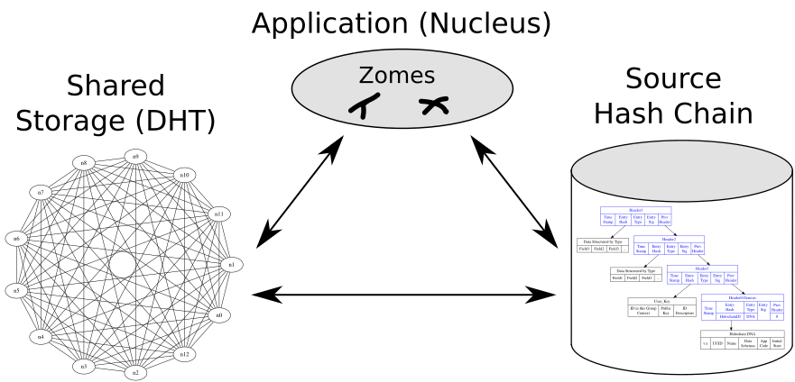

一、 概述
---------
## 什么是HoloChain

Holochain不是区块链，Holochain是一种技术——在分布式哈希表（DHT）和自定义数据验证上进行拼接以实现不同模式的分布式计算技术。在区块链中，每个节点都努力拥有分布式账本相同的最新的副本。区块链也存在极高的存储成本和低可扩展性的障碍。Holochain试图打破这些障碍，以便让应用程序开发人员更便宜并且能够快速运行他们的产品。Holochain与区块链的区别在于，它试图成为一种轻量级架构，即使手机和其他低容量设备也可以运行网络。

每个Holochain都有三个主要的子系统，如下图所示




> 应用程序(Application)将所有部分组合成一个统一整体。可以使用Web浏览器连接到用户界面，此应用程序可以在本地签名哈希链上进行读写，也可以从共享DHT获取数据，并将数据放在共享DHT上。最重要的是，它提供了每个人运行的验证规则，以确保共享DHT中保存的数据不会被篡改，伪造或丢失。

> 本地源链(Source Hash Chain)是指除了区块链之类的共享全局分类账外，每个人都有自己的本地链，在将它们发布到共享DHT之前，他们会签署这些链。涉及多方的交互（例如两个人之间的货币转移）由每一方签署并致力于他们自己的链，然后由各方共享给DHT。

> 验证DHT的共享存储(shared storge DHT)：这部分会在后面进行详细讲解。

如果应用程序（如分布式Facebook，Twitter，Slack，Uber或AirBnB）在Holochain上运行，可以将推文写入自己的链，然后分享它。然后信息可以通过共享DHT传播，其中节点可以根据共享规则或期望执行此操作。


## Holochain应用场景

Holochain旨在支持和体现社会凝聚力，例如希望根据一系列协议进行协作或协调的团体。这些协议允许他们以可靠的方式共享数据或其他价值。Holochains适合的应用场景有：

- 社交网络，社交媒体和VRM：您希望在没有像Facebook这样的公司的情况下运行社交网络。您希望共享，发布，发布或推文到共享空间，同时自动在这些设备上保留这些内容的副本。  
- 供应链和开放式价值网络：您希望获得跨越公司，组织，国家/地区的信息，这些信息是协作共享和管理的，但不受任何一个组织的中央控制。
- 合作社和新下议院：你想要创造一些真正集体而非任何特定个人的东西。这对数字资产尤其有用。 
- P2P平台：点对点应用程序，每个人都有相似的功能，访问权限，责任和价值，这些应用程序是集体生成的。 
- 集体智慧：治理，决策框架，反馈系统，评级，货币，注释或工作流程系统。
- 协作应用程序：聊天，讨论板，计划应用程序，Wiki，文档等。 
- 声誉或互信用加密货币：通过同行的行为（如评级）或通过复式会计处理发行的货币非常适合。

二、分析
--------

## (一) 共识

Holochain是一个采用DHT(分布式哈希表)技术的创新项目，借助BitTorrent 的并行性，为分布式应用（DAPP）提供动力，它是分布式应用程序的数据完整性引擎。它可以将具有用户自主权的分布式 Web 直接构建到其架构和协议中。 

Holochain和区块链是针对截然不同的应用场景而构建的。对于维持绝对的全球共识的系统来说，区块链相对有优势。在需要弱共识（大多数情况下）的情况下，Holochain 比区块链要好得多：它更快，更高效，更具可扩展性，适应性强和可扩展性。分布式账本技术（DLT）可互换的分支分别是有向无环图（DAG）、Swirlds的哈希图Hashgraph、Holoochain 的分布式散列表（DHT）、区块链，四者是并列关系。 

Holochain的DHT(分布式哈希表)技术，它是将全网账本分布式的存储在网络中的各个节点上。在Holo中，每个用户都是一条链，存储一部分数据，每个APP用户的链上存储着APP的“DNA”（运行APP的代码）。所有APP完整的数据通过分布式哈希表的方式随机存储在各个节点上，同时这些数据是可以被验证防篡改的，因为如果改变数据其对应的DHT表也会改变。

Holochain的核心理念是以代理为中心，由用户来驱动共识的形成。

这里以Git协议为例讲解。Git用于源代码管理，是一种DAG（有向无环图），但它并不以数据为中心进行管理。它的操作逻辑是这样：假设你有3个开发人员，每个开发人员都在开发他们自己的代码版本，当开发者A完成手头工作时，他会将他的代码提交到Git中。当开发者B完成了手头的工作，他也会提交他的代码，Git会自动合并开发者A与B提交的代码（因为没有任何冲突），但当开发者C提交代码进行合并时，冲突或许就产生了，开发者A、B、C三者必须在这些数据上达成共识。

这里有趣的含义就是共识的分化，正如上面的例子，开发者A与B达成了共识后，直到开发者C上传代码前，它们三者并不需要全都达成共识。

这正是Holochain在试图完成的事，每个节点都可以拥有自己的源，只有当这些需要与其他节点共享时才需要形成共识，因此，人们可以在Holochain的源头中构建自己的环境并构建自己的dApp（或hApp），若非必要，就无需与分布式哈希表（DHT）中的其余部分进行交互。

这是Holochain与Blockchain的一个重要区别。“Holochain是一个不断验证的分布式哈希表（DHT），其中的每个节点都会对数据发起自己的签名以执行数据验证，这并非是真正意义上的共识，而是所谓的“区块链式”。

所以这里需要注意到的事每个人都会拥有自己的哈希链，如果我想将资金转移给你，我们都需要在自己的本地副本上进行签名操作，随后再将其分享给外部的节点。

这里的核心想法就是并非所有的数据都与要与所有人共享，如果A与B之间希望进行一笔转账，只要他们双方同意，C和其他人其实都没有必要知道这笔交易。对于不需要所有方共同参与的系统，比如社交网络、聊天程序、P2P平台、协作文档等而言，这都是一个好主意，着本质上是一个大型的共享Git仓库协作。

### 什么是DHT 

DHT的全称是Distributed Hash Table,即分布式哈希表技术，是一种分布式的存储方法。


这种分布式网络不需要中心节点服务器，而是每个客户端负责一个小范围的路由，并负责存储一小部分数据，从而实现整个DHT网络的寻址和存储。DHT网络还在于关键字最接近的节点上复制备份冗余信息，避免了单一节点失效问题。形象地，我们可以把整个DHT网络想象成一个大城市，那么每个客户端，就好比城市里各个角落的地图碎片，上面绘制了附近区域的地形情况，把这些地图碎片汇总后，整个城市的全貌也就出来了。分布式哈希表是分布式计算系统中的一类，用来将一个键（key）的集合分散到所有在分布式系统中的节点。这里的节点类似哈希表中的存储位置。分布式哈希表通常是为了拥有大量节点的系统，而且系统的节点常常会加入或离开。

### 分布式散列表特性

> 离散性：构成系统的节点并没有任何中央式的协调机制。
  
> 伸缩性：即使有成千上万个节点，系统仍然应该十分有效率。
  
> 容错性：即使节点不断地加入、离开或是停止工作，系统仍然必须达到一定的可靠度。
  
要达到以上的目标，有一个关键的技术：任一个节点只需要与系统中的部分节点沟通。一般来说，若系统有n个节点，那么只有n个节点是必须的。因此，当成员改变的时候，只有一部分的工作（例如数据或关键值的发送，散列表的改变等）必须要完成。
  
最后，分布式散列表必须处理传统分布式系统可能遇到的问题，例如负载平衡、数据完整性，以及性能问题（特别是确认转送消息、数据存储及读取等动作能快速完成）。

在验证的DHT中，需要确认每个数据的来源，验证其作者的签名，并且保证它已经致力于他们的本地链。多方交易创造了链条的“交叉”，这也确保即使尝试更改自己的链条，你的的交易也会由其他人发布。DHT还有一个不寻常的功能，它允许将元数据放在DHT中的数据上，该数据可用于发布有关人/节点（例如他们的交易，或他们的主干链的顶部）或数据元素（例如标签，评论或评级）。就像区块链节点上的验证规则一样，如果有人攻击他们的代码以表现不同，即使他们与其他人勾结，DHT上的其余节点也不会验证他们改变的行为，他们基本上只是将自己分开参加那个holochain。

在Holochain上，负责接收事务记录的每个节点根据应用程序发布和预先建立的规则进行身份验证，并使用Gossip协议传播（Gossips）到其他节点（Peers）。如果规则被破坏，验证者将拒绝验证该交易。


### 什么是 Gossip协议

Gossip协议使用随机方式在网络上传播信息。就像Gossip本身的含义一样，Gossip协议的工作流程类似于轶事的传播，就像办公室里的同事喜欢谈论是非，当信息告诉同事时，信息会传播到办公室在有限的时间内。办公室里的人都会知道八卦的信息，这类似于病毒的传播。因此，Gossip也有“病毒感染算法”和“谣言传播算法”的名称。

Gossip协议可分为基于pull和基于push的

基于Push的Gossip协议的具体工作流程如下，具有状态新信息的节点随机选择联系节点并考虑发送自身以获取信息。

1. 网络中的节点随机选择其他b节点作为传输对象。
2. 节点将相应的信息发送到其选择的b节点。
3. 接收信息的节点重复相同的工作

基于拉的八卦协议的协议过程恰恰相反，发起信息交换的节点随机选择联系节点并从另一方获取信息。
1. 节点v随机选择b个节点，询问是否有最新信息。
2. 接收请求的节点使用最近未收到的信息回复节点v。


Gossip协议的优势：
> 可扩展性（Scalable）：gossip 协议是可扩展的，一般需要 O(logN) 轮就可以将信息传播到所有的节点，其中 N 代表节点的个数。每个节点仅发送固定数量的消息，并且与网络中节点数目无法。在数据传送的时候，节点并不会等待消息的 ack，所以消息传送失败也没有关系，因为可以通过其他节点将消息传递给之前传送失败的节点。系统可以轻松扩展到数百万个进程。

> 容错（Fault-tolerance）：网络中任何节点的重启或者宕机都不会影响 gossip 协议的运行。

> 健壮性（Robust）：gossip 协议是去中心化的协议，所以集群中的所有节点都是对等的，没有特殊的节点，所以任何节点出现问题都不会阻止其他节点继续发送消息。任何节点都可以随时加入或离开，而不会影响系统的整体服务质量（QOS）
最终一致性（Convergent consistency）：Gossip 协议实现信息指数级的快速传播，因此在有新信息需要传播时，消息可以快速地发送到全局节点，在有限的时间内能够做到所有节点都拥有最新的数据。

Gossip的缺点也很明显，冗余通信会对网路带宽、CUP资源造成很大的负载，而这些负载又受限于通信频率，该频率又影响着算法收敛的速度。为了改善Gossip协议的性能，还存在基于推挽的混合协议，其中发起信息交换的节点将信息发送到所选节点。

##  (二) 安全

由于DHT的分散性，容错性和可扩展性，它们本质上比典型的集中式系统更能抵御恶意攻击者。
用于分散数据存储的开放系统应对大规模恶意攻击者是可行的，经过精心设计以具有拜占庭容错能力的DHT系统可以抵御Sybil攻击(女巫攻击)，这种攻击影响所有当前的DHT设计。Kademlia的原始作者之一Petar Maymounkov提出了一种方法，通过将社会信任关系纳入系统设计来规避Sybil攻击。然而，对有效防御女巫攻击的研究通常被认为是一个悬而未决的问题，每年在顶级安全研究会议上提出各种各样的潜在防御措施。

###  针对DHT的攻击方法
大致归纳为七种。我们假设攻击者是具有破坏性意图的个体，暂时将其称为E;受害者可能是一个或多个人，我们称之为V：  
​```Sybil攻击```：Sybil Attack是在对等网络中常见的一种攻击，其中网络中的节点同时主动运行多个身份并破坏信誉系统中的权限/功能。 此攻击的主要目的是获得网络中的大部分影响，以执行系统中的非法（关于网络中设置的规则和法律）操作。 单个实体（计算机）具有创建和操作多个身份（用户帐户，基于IP地址的帐户）的能力。 对于外部观察者来说，这些多个假身份似乎是真正独特的身份。例如:很多E的同伴加入了这个班级，而E一个人在这个班级中占主导地位。在DHT中，只有可以代表节点“身份”的节点号，但是，节点号太薄且易于修改，因此攻击者可以批量生产假身份潜行并控制整个网络。身份是一个难题。在今天的网络协议中，我们只能依靠少数权威机构（如政府或互联网服务提供商）提供身份认证。这显然不是一种分散的，以隐私为导向的方法。  
​```日蚀攻击(Eclipse Attack)```：假设E与V的邻居互相勾结，导致V被隔离，E可以知道所有V收发的内容。
由于节点号可以自由更改，因此攻击者可以选择特定的受害者并将攻击节点的数量修改为接近受害者，以便受害者的路由表被攻击者的节点占用。一旦受害者在攻击者的网络中“孤立”，攻击者就可以阻止，监视甚至篡改受害者的查询消息。  
​```扰动攻击```：假设E经常在课堂上进出教室，因此V无法查找自己的分数并影响V收发message的效率。由于加入/退出DHT几乎不需要资源，攻击者可以频繁地进入和离开网络，导致相邻节点耗尽路由表的更新，导致网络拥塞和离线资源不可用。特别是在Chord缺乏冗余的情况下（路由表仅对应于每个间隔中的一个节点）并且路由更新过程非常麻烦（需要4个步骤），它甚至更能抵抗干扰攻击。  
​```对抗性路由```：E随机发送V的消息。
在DHT的开放环境中，参与者的行为是不可预测的。攻击者可以将消息中继到攻击者的隔离网络，也可以直接拒绝处理，无论路由表如何。对于没有冗余的Chord，这种攻击是完全相同的。棘手。一个运作良好的开放，分散的系统需要基于参与者的正常行为;一个设计良好，开放，分散的系统必须确保系统运行良好，这意味着它奖励正常行为并惩罚随机行为或限制随机行为的发生。根据这样的定义，DHT缺乏奖励和惩罚机制以及约束机制，这不是一个精心设计的开放和分散的系统。  
​```污染攻击```：E篡改自己的分数并使V得到其它分数。
污染攻击与恶意路由一样简单和暴力：攻击者直接返回错误的结果并且查询失败，这对于Chord缺乏冗余同样棘手。虽然只需要检查内容的哈希值和关键值来检查内容是否被污染，但足够规模的污染仍然可以粉碎整个网络。  
​```索引中毒```：当座位表传递给自己时，E篡改V的座位号。
DHT必须通过索引表获取全局概览，索引表通常由第三方服务（例如BitTorrent的种子站点）管理，这对于文件共享应用程序至关重要。但是，第三方服务无法阻止攻击者将DHT集中注入无害甚至有害的资源（如特洛伊木马）以污染索引表。这些有害资源被伪装成有意义的资源（你知道）以吸引用户下载，攻击者自己也不必承担任何费用（不占用自己的带宽）。  
​```拒绝服务```：E不断传递消息，因此V没有时间接受传递其他人的消息。
服务阻塞是攻击者通过各种手段耗尽服务提供者的有限资源，使其无法再提供任何服务来实现服务的目的。由于任何协议都受到网络带宽和计算资源的限制，因此DHT只能耗尽大量查询以使节点耗尽（内存/硬盘空间/带宽等）。 DHT具有分散和规模的特点，在体能方面具有很强的抗服务阻塞能力，但仍然无法在足够规模的服务阻塞中存活下来。  


Holochain没有全球“准确性”或“共识”。相反，负责接收事务记录的每个节点都会根据应用程序建立的规则进行身份验证，并且您的对方成为第一个验证您的事务并将其传播（Gossips）到其他节点的验证者。如果规则被破坏，验证者将拒绝验证该交易。如果在节点上检测到任何犯规，例如节点正在传播或验证错误数据，则阻止该节点并向其他人发送警告。 Holochain使用基于帐户的系统通过其他节点（Peers）进行数据验证，而不是全局共识系统。


Holochain通过使用“DNA”在每个哈希链上建立了一定程度的安全性能，“DNA”实际上充当了特定于应用程序的合约。与所有用户角色一样，主要权利和责任的体现在遵循HOLO应用程序DNA中编码的规则，以及任何违反应用程序DNA结构的操作，将会导致区块的哈希值的变动，并有效地将用户分叉到他或她自己的私有恶意链中，从而无法影响其他人。

与iExec相比，这给Holochain带来了额外的功能优势，iExec旨在实现全网共识，而这一功能在以太坊实施扩展解决方案之前将会受到阻碍。

总的来说，用户是被激励不要去欺骗系统中的其他人，因为他们知道当他们被捕获时，他们在HOLO的所有特权都可能被撤销（被称为“免疫系统响应”，就像有机生物对恶性细胞的反应一样 ）。

在Holochain上，每个通信和数据元素都是由其作者签署到其各自的不可变链（或者这个链不会传播）。如果参与者采取恶意行为，他们的行为将被发布到不可否认的记录上，类似于能够拒绝下一笔交易的数字指纹。在串通的情况下，目睹此行为的第一个actor会警告其他节点。注意到共谋的节点也会警告其他的节点——即这是一个分布式执行机制，最终会网络中的节点会拒绝与网络上的那些被警报的节点进行交易。

这是该“免疫系统”的基础，因为任何节点都可以创建标记欺诈行为的“权证”，并提供恶意行为者的原始签名记录作为证据。然后权证可以作为欺诈的证据进行传播，因此其他共谋节点也会被转移到黑名单。

这种app-to-app的安全机制与iExec和Hashgraph部署的整体方法形成鲜明对比，后者是适用于整个网络。


在许多方面，这种结构代表了一种彻底的转变，远离当前的典型的网络化范例。对于未来项目来讲，这是一个十分具有吸引力的替代方案，因为它体现了迄今为止加密项目中无与伦比的灵活性。

## (三) 性能

由于采用了以代理为中心的计算，Holochain的性能相比于传统的区块链项目有质的提高。对于 Blockchain来说，假设整个区块的交易总数为n，全网节点总数为m，则以太坊的时间复杂度可简单表示为`O(n*m)`; 对 于Holochain来说，执行n个交易的时间复杂度可简单表示为 `O(n/m*logm)`。假设交易总数为1000，全网节点数为1024，经过计算可以得出，以太坊的 时间复杂度是106，Holochain的时间复杂度是10。

从TPS来看，比特币的每秒交易处理量(TPS)是7,以太坊是20+,而 Holochain由于是局部共识,节点越多,处理能力越强,理论上没有上限。


## (四) 社区

#### 社区参与

除了基于Holochain开发的去中心化聊天室，Holochain社区成员主要集中在Facebook、Twitter、Reddit和Telegram上，具体数据如下：

- [Facebook | 5,3K Followers](https://www.facebook.com/holochain.design/)
- [Twitter | 29,1K Followers](https://twitter.com/holochain)
- [Reddit | 6,5K Readers](https://www.reddit.com/r/holochain/)
- [Telegram | 13,2K Members](https://t.me/channelHolo)
- [Medium](https://medium.com/holochain)

#### 开发者支持

在Github上，Holochain一共开源了102个项目，除了核心的holochain-rust，其他大部分是是基于holochain开发的区中心应用，具体数据如下：

| repository | commits | branches | contributors | watch | star |fork|
|-----------------|--------|-------|------|------|-------|-------|
| holochain-rust  |  12,487 |  276  | 40 | 92  |  702  |238|
| n3h |   658   |  32   |  6   |  15   |  19   |4|
| holochain-basic-chat  |  190  |  35   |  4  | 20   |   13   |7|
| hc-web-client  |  116    |   17   |   6  |  16   |   17   |3|
| cryptographic-autonomy-license  |  4   |   1  |  2  | 17   |  12   |1|
| docs-pages  | 233    |  12   |  4 |   13 |  3   |2|

Holochain一开始是使用Go进行开发，后来考虑到Rust的安全性，稳定性和并发性安全性，以及能够编译到Web Assembly。因此，去年5月份，Holochain团队使用Rust重构了其核心代码，其在GitHub上的表现如下：


#### 激励模型

当前代币为HOT,总量1776亿。75%用于ICO(流通),共筹集了30202个ETH;25%由团队持有(锁定)。主网上线后HOT将映射为 Holo fuel, Holo fue是Holo的加密信用凭证,它将用于APP开发者支付Hoo网络上的主机服务,主机提供者将获得Holo Fue作为提供算力和存储的报酬,任何一个主机提供者都可以设定自己的价格,当整个网络资源不足时,主机提供者可以设定较高的价格,同时吸引更多主机加入网络,当整个网络资 源过剩时,主机提供者只能降低价格,同时成本过高的主机会退出网络,从而实现网络资源的平衡。

另外Holo有一个储蓄账户,用于提供 Holo fue和其他货币之间的兑换,比如APP开发者 没有 Holo fue时可以通过向储蓄账户支付法币或比特币等数字货币来换取 Holo fuel;主机通过对外提供服务挣得的 Holo fue也可以通过储蓄账户兑换成法币或其他数字货币。 Holo作为服务提供方,对于每一笔交易都会收取不高于1%的服务费。


三、总结
--------

Holochain看起来很有希望。它从SONM和DADI中脱颖而出，它将为即将到来的网络开发人员提供高度的接触式（基本上）培训，并通过预售其硬件设备预先布局其网络。不仅仅是分散式云计算，它将区块链本身作为去中心化计算的顶级架构。如果成功，一般来说，它将是更便宜、更快速的区块链。使用类似Git的共识模式允许应用程序是独立的（就像侧链对于根链而言）。每个节点都不需要累积，这就解决了“昂贵的存储”成本问题。
