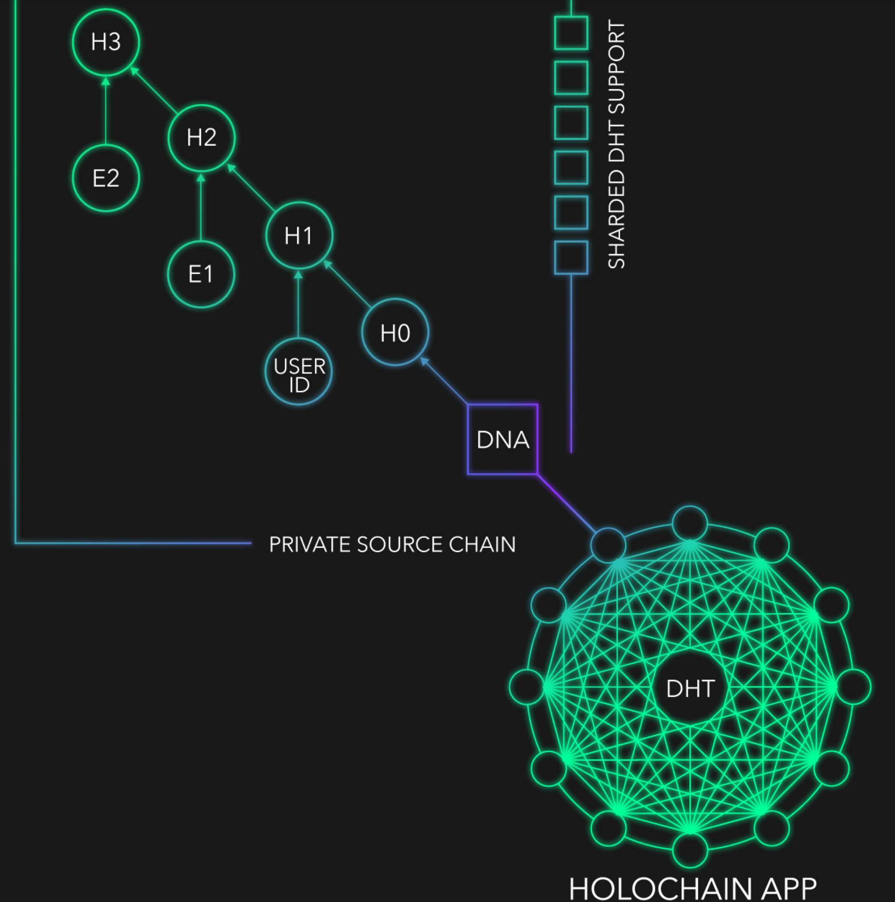
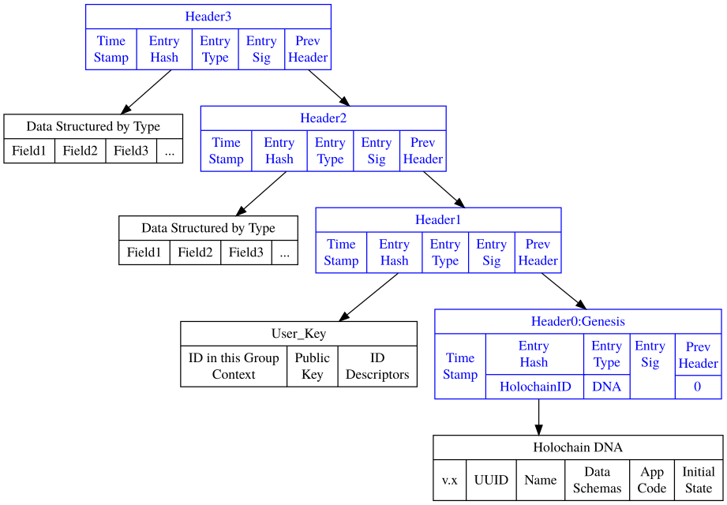
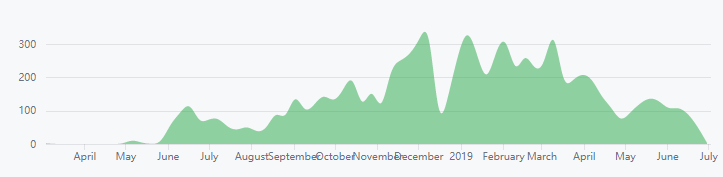

一、 概述
---------
# 什么是HoloChain
在区块链中，每个节点都努力拥有分布式账本相同的最新的副本。区块链也存在极高的存储成本和低可扩展性的障碍。Holochain试图打破这些障碍，以便让应用程序开发人员更便宜并且能够快速运行他们的产品。Holochain与区块链的区别在于，它试图成为一种轻量级架构，即使手机和其他低容量设备也可以运行网络。  

Holochain不是区块链,Holochain是一种技术——在分布式哈希表（DHT）和自定义数据验证上进行拼接以实现不同模式的分布式计算技术。  

每个holochain都有三个主要的子系统，如下图所示

应用程序(Application)将所有部分组合成一个统一整体。可以使用Web浏览器连接到用户界面，此应用程序可以在本地签名哈希链上进行读写，也可以从共享DHT获取数据，并将数据放在共享DHT上。最重要的是，它提供了每个人运行的验证规则，以确保共享DHT中保存的数据不会被篡改，伪造或丢失。

本地源链(local source chain)是指除了区块链之类的共享全局分类账外，每个人都有自己的本地链，在将它们发布到共享DHT之前，他们会签署这些链。涉及多方的交互（例如两个人之间的货币转移）由每一方签署并致力于他们自己的链，然后由各方共享给DHT。

如果应用程序（如分布式Facebook，Twitter，Slack，Uber或AirBnB）在holochain上运行，可以将推文写入自己的链，然后分享它。然后信息可以通过共享DHT传播，其中节点可以根据共享规则或期望执行此操作。

验证DHT的共享存储
# 什么是DHT 
DHT的全称是Distributed Hash Table,即分布式哈希表技术，是一种分布式的存储方法。

这种分布式网络不需要中心节点服务器，而是每个客户端负责一个小范围的路由，并负责存储一小部分数据，从而实现整个DHT网络的寻址和存储。DHT网络还在于关键字最接近的节点上复制备份冗余信息，避免了单一节点失效问题。形象地，我们可以把整个DHT网络想象成一个大城市，那么每个客户端，就好比城市里各个角落的地图碎片，上面绘制了附近区域的地形情况，把这些地图碎片汇总后，整个城市的全貌也就出来了。分布式哈希表是分布式计算系统中的一类，用来将一个键（key）的集合分散到所有在分布式系统中的节点。这里的节点类似哈希表中的存储位置。分布式哈希表通常是为了拥有大量节点的系统，而且系统的节点常常会加入或离开。
# 分布式散列表特性

离散性：构成系统的节点并没有任何中央式的协调机制。  
伸缩性：即使有成千上万个节点，系统仍然应该十分有效率。  
容错性：即使节点不断地加入、离开或是停止工作，系统仍然必须达到一定的可靠度。
要达到以上的目标，有一个关键的技术：任一个节点只需要与系统中的部分节点沟通。一般来说，若系统有n个节点，那么只有n个节点是必须的。因此，当成员改变的时候，只有一部分的工作（例如数据或关键值的发送，散列表的改变等）必须要完成。  
最后，分布式散列表必须处理传统分布式系统可能遇到的问题，例如负载平衡、数据完整性，以及性能问题（特别是确认转送消息、数据存储及读取等动作能快速完成）。

在验证的DHT中，需要确认每个数据的来源，验证其作者的签名，并且保证它已经致力于他们的本地链。多方交易创造了链条的“交叉”，这也确保即使尝试更改自己的链条，你的的交易也会由其他人发布。DHT还有一个不寻常的功能，它允许将元数据放在DHT中的数据上，该数据可用于发布有关人/节点（例如他们的交易，或他们的主干链的顶部）或数据元素（例如标签，评论或评级）。就像区块链节点上的验证规则一样，如果有人攻击他们的代码以表现不同，即使他们与其他人勾结，DHT上的其余节点也不会验证他们改变的行为，他们基本上只是将自己分开参加那个holochain。

# Holochain应用场景
Holochain旨在支持和体现社会凝聚力，例如希望根据一系列协议进行协作或协调的团体。这些协议允许他们以可靠的方式共享数据或其他价值。

Holochains非常适合：

社交网络，社交媒体和VRM：您希望在没有像Facebook这样的公司的情况下运行社交网络。您希望共享，发布，发布或推文到共享空间，同时自动在这些设备上保留这些内容的副本。
供应链和开放式价值网络：您希望获得跨越公司，组织，国家/地区的信息，这些信息是协作共享和管理的，但不受任何一个组织的中央控制。
合作社和新下议院：你想要创造一些真正集体而非任何特定个人的东西。这对数字资产尤其有用。
P2P平台：点对点应用程序，每个人都有相似的功能，访问权限，责任和价值，这些应用程序是集体生成的。
集体智慧：治理，决策框架，反馈系统，评级，货币，注释或工作流程系统。
协作应用程序：聊天，讨论板，计划应用程序，Wiki，文档等。
声誉或互信用加密货币：通过同行的行为（如评级）或通过复式会计处理发行的货币非常适合于全息图。认为代币存在独立于代理人责任的菲亚特货币在全息链上实施起来更具挑战性。

二、分析
--------

### (一) 共识

###  (二) 安全
# Holochain实现的关键  
Holochain被描述为来自BitTorrent、GitHub和区块链的经过验证的技术的结合。

具体来说，在Holochain网络上，每个节点都运行自己的链，就像GitHub开发人员自己复制源代码的方式一样，并且可以从中央存储库中检入和退出。通过BitTorrent，Holochain使用所谓的“分布式哈希表”（DHT），这是一种使用密钥存储数据的方式，但数据的实际位置可以分布在许多地方。当然，还有区块链技术，它允许在不需要中央服务器的情况下进行安全存储。该系统支持分布式存储和数据完整性验证。

Holochain不是区块链，它是什么？

Holo使用另一种称为相互信用货币的系统，这是一种资产支持的货币，其运作方式与区块链完全不同。在里面，没有人可以凭空产生Holofuel，无法开采或燃烧，并且必须通过提供资源共享服务来交换Holofuel。所有交易都记录在复式簿记中。当一方的余额增加时，另一方的余额减少，净供应总是为零。所有交易均衡并相互抵消。

如何在Holochain上验证数据或交易？

在Holochain上，负责接收事务记录的每个节点根据应用程序发布和预先建立的规则进行身份验证，并使用Gossip协议传播（Gossips）到其他节点（Peers）。如果规则被破坏，验证者将拒绝验证该交易。

Gossip协议的原则

Gossip协议使用随机方式在网络上传播信息。就像Gossip本身的含义一样，Gossip协议的工作流程类似于轶事的传播，就像办公室里的同事喜欢谈论是非，当信息告诉同事时，信息会传播到办公室在有限的时间内。办公室里的人都会知道八卦的信息，这类似于病毒的传播。因此，Gossip也有“病毒感染算法”和“谣言传播算法”的名称。

Gossip协议可分为基于pull和基于push的

基于Push的Gossip协议的具体工作流程如下
具有状态新信息的节点随机选择联系节点并考虑发送自身以获取信息。
1.网络中的节点随机选择其他b节点作为传输对象。
2.节点将相应的信息发送到其选择的b节点。
3.接收信息的节点重复相同的工作

基于拉的八卦协议的协议过程恰恰相反
发起信息交换的节点随机选择联系节点并从另一方获取信息。
1.节点v随机选择b个节点，询问是否有最新信息。
2.接收请求的节点使用最近未收到的信息回复节点v。

为了改善Gossip协议的性能，还存在基于推挽的混合协议，其中发起信息交换的节点将信息发送到所选节点。

Gossip协议 -  Holochain

Holochain没有全球“准确性”或“共识”。相反，负责接收事务记录的每个节点都会根据应用程序建立的规则进行身份验证，并且您的对方成为第一个验证您的事务并将其传播（Gossips）到其他节点的验证者。如果规则被破坏，验证者将拒绝验证该交易。如果在节点上检测到任何犯规，例如节点正在传播或验证错误数据，则阻止该节点并向其他人发送警告。 Holochain使用基于帐户的系统通过其他节点（Peers）进行数据验证，而不是全局共识系统。

Holochain通过使用“DNA”在每个哈希链上建立了一定程度的安全性能，“DNA”实际上充当了特定于应用程序的合约。与所有用户角色一样，主要权利和责任的体现在遵循HOLO应用程序DNA中编码的规则，以及任何违反应用程序DNA结构的操作，将会导致区块的哈希值的变动，并有效地将用户分叉到他或她自己的私有恶意链中，从而无法影响其他人。

与iExec相比，这给Holochain带来了额外的功能优势，iExec旨在实现全网共识，而这一功能在以太坊实施扩展解决方案之前将会受到阻碍。

总的来说，用户是被激励不要去欺骗系统中的其他人，因为他们知道当他们被捕获时，他们在HOLO的所有特权都可能被撤销（被称为“免疫系统响应”，就像有机生物对恶性细胞的反应一样 ）。

在Holochain上，每个通信和数据元素都是由其作者签署到其各自的不可变链（或者这个链不会传播）。如果参与者采取恶意行为，他们的行为将被发布到不可否认的记录上，类似于能够拒绝下一笔交易的数字指纹。在串通的情况下，目睹此行为的第一个actor会警告其他节点。注意到共谋的节点也会警告其他的节点——即这是一个分布式执行机制，最终会网络中的节点会拒绝与网络上的那些被警报的节点进行交易。

这是该“免疫系统”的基础，因为任何节点都可以创建标记欺诈行为的“权证”，并提供恶意行为者的原始签名记录作为证据。然后权证可以作为欺诈的证据进行传播，因此其他共谋节点也会被转移到黑名单。

这种app-to-app的安全机制与iExec和Hashgraph部署的整体方法形成鲜明对比，后者是适用于整个网络。

对于开发人员和用户来说，这里的优势在于并非所有dApp方案都需要相同级别的安全性，因此应用程序构建者可以自由选择自己的安全级别，并由用户根据他们想要遵循的规则进行投票。

在许多方面，这种结构代表了一种彻底的转变，远离当前的典型的网络化范例。对于未来项目来讲，这是一个十分具有吸引力的替代方案，因为它体现了迄今为止加密项目中无与伦比的灵活性。

### (三) 性能

### (四) 社区

#### 社区参与

- [Facebook | 5,3K Followers](https://www.facebook.com/holochain.design/)
- [Twitter | 29,1K Followers](https://twitter.com/holochain)
- [Reddit | 6,5K Readers](https://www.reddit.com/r/holochain/)
- [Telegram | 13,2K Members](https://t.me/channelHolo)
- [Medium](https://medium.com/holochain)

#### 开发者支持

| repository | commits | branches | contributors | watch | star |fork|
|-----------------|--------|-------|------|------|-------|-------|
| holochain-rust  |  12,487 |  276  | 40 | 92  |  702  |238|
| n3h |   658   |  32   |  6   |  15   |  19   |4|
| holochain-basic-chat  |  190  |  35   |  4  | 20   |   13   |7|
| hc-web-client  |  116    |   17   |   6  |  16   |   17   |3|
| cryptographic-autonomy-license  |  4   |   1  |  2  | 17   |  12   |1|
| docs-pages  | 233    |  12   |  4 |   13 |  3   |2|

#### 技术管理

#### 激励模型

#### 网络规模

三、总结
--------
