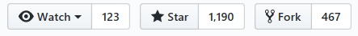
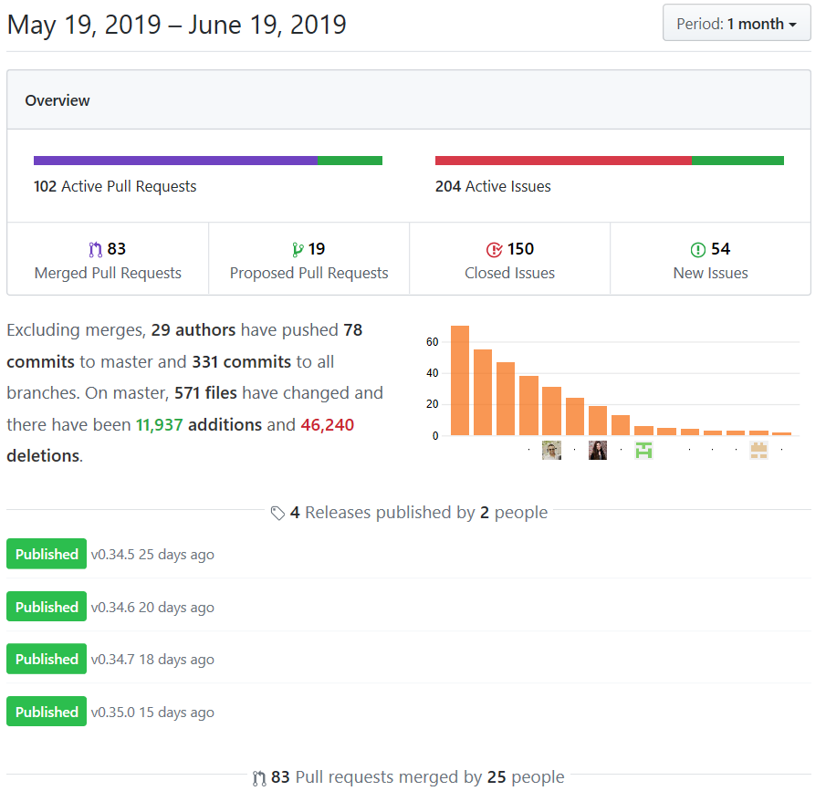
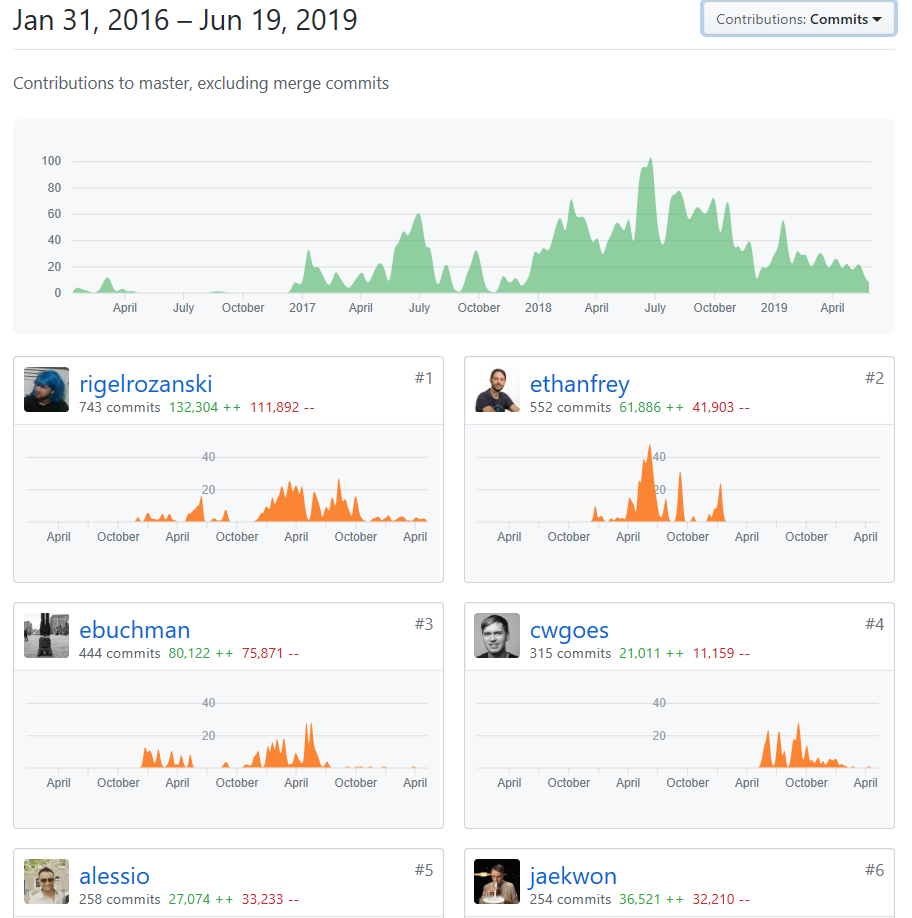
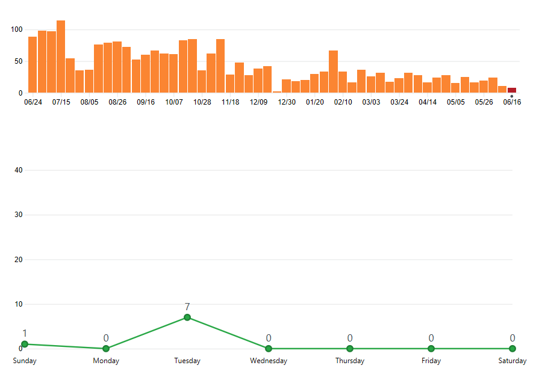
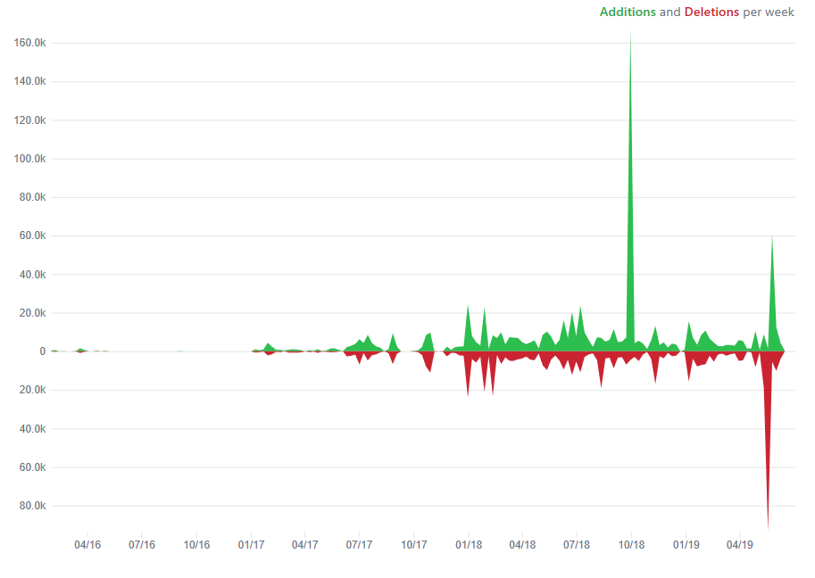
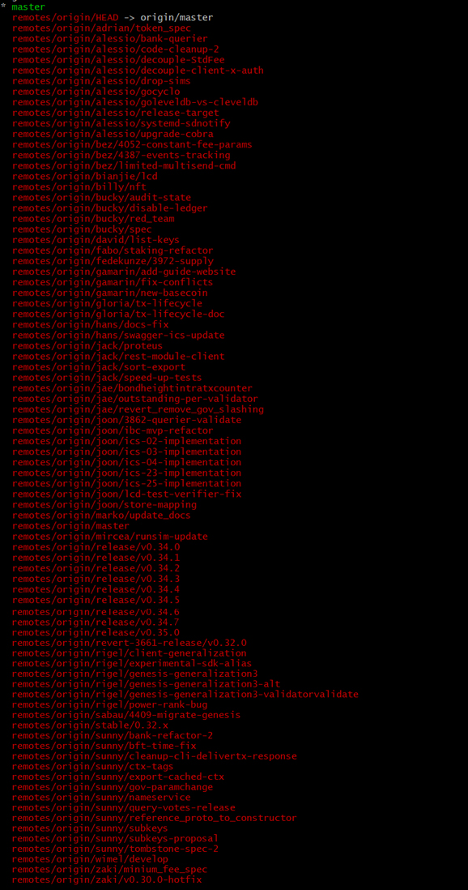

# Cosmos-SDK代码分析
## 开发者行为的指标收集
### 项目技术整体图
#### 受欢迎程度
  
#### 活跃

#### 主要贡献者
  
#### 提交
  
#### 代码提交频率
 
#### 分支
  
#### 分析

Cosmos项目起始于2016第一季度，随后于一年后的2017年第一季度开始撰写代码，当年的10月、12月出现代码更新的短期中断，2018年开始逐渐增加代码工作量，于2018年10月达到代码增加最高峰，峰值为代码平均增加量的10倍，初步被判断为独立开发模块编写完成后整体加入项目。2019年开始，保持平均工作量不变的情况下，于2019年4月出现代码删除和增加的峰值，增加峰值为平均水平的5倍，删除峰值为平均水平十倍，打破代码增删曲线平衡，初步判断为项目整改期。

从开发者角度来看，整体工作于2018、2019年开始呈现增长，主要贡献者持续活跃，可以认为2018-2019为该项目正式开发时期，其中包含整改与审查工作。

### 社区讨论
#### Issues
一共有359个issues，其中内容数量超过10条的主题有：
| Issue主题 | 讨论与提交 |
| :------ | ------: |
| 安全 | 10 |
| Bug |	14 |
| 删减 |	14 |
| 用户体验 | 19 |
| 测试 | 20 |
| 指令行界面 |	21 |
| 代码健康 | 23|
| REST格式 |	24 |
| 讨论 | 30 |
| 核心问题 |34 |
| 新问题 |	35|
| 发布后解决 |	40|
| 文档 |	48|
| 提议 |	60|

## Cosmos-SDK代码分析
### 大体数据结构与说明
#### baseapp/baseapp.go
```go
mainConsensusParamsKey商店中共识参数存储的Key
type BaseApp struct {
	// initialized on creation
	logger      log.Logger
	name        string               // 来自abci.Info的应用程序名称
	db          dbm.DB               // 常见DB后端
	cms         sdk.CommitMultiStore // 主要（未缓存）状态
	router      sdk.Router           // 处理任何类型的消息
	queryRouter sdk.QueryRouter      // 用于重定向查询调用的路由器
	txDecoder   sdk.TxDecoder        // []byte转换为sdk.Tx

	baseKey *sdk.KVStoreKey // cms中的主要KVStore 在LoadVersion或LoadLatestVersion上设置

	anteHandler    sdk.AnteHandler  // 费用和认证的赌注处理程序
	initChainer    sdk.InitChainer  // 使用验证器和状态blob初始化状态
	beginBlocker   sdk.BeginBlocker // 在任何tx之前运行的逻辑
	endBlocker     sdk.EndBlocker   // 在所有tx之后运行的逻辑，并确定valset更改
	addrPeerFilter sdk.PeerFilter   // 按地址和端口过滤对等体
	idPeerFilter   sdk.PeerFilter   // 按节点ID过滤对等体
	fauxMerkleMode bool             // 如果为true，IAVL MountStores使用MountStoresDB来模拟速度

	// --------------------
	//易失性状态
	checkState   *state          // for CheckTx	在初始化时设置并在Commit上重置
	deliverState *state          // for DeliverTx	在InitChain和BeginBlock中设置并在Commit上清除
	voteInfos    []abci.VoteInfo // 来自开始块的缺失验证器

	consensusParams *abci.ConsensusParams	// 共识参数 TODO：将来将此移动到主商店的baseapp param商店。

	minGasPrices sdk.DecCoins	// 验证者愿意接受处理交易的最低汽油价格。这主要用于DoS和垃圾邮件预防

	sealed bool	// 用于密封选项和BaseApp参数的标志

	haltHeight uint64	// 停止链并正常关闭的高度

	appVersion string	// 应用程序的版本字符串
}
```

