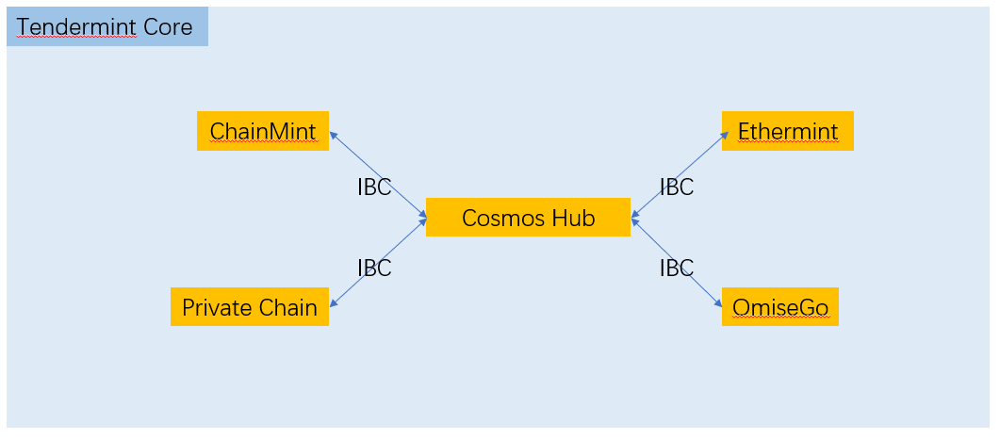
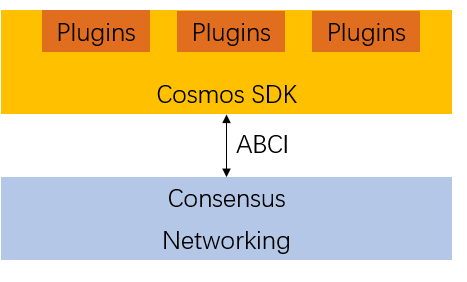

# Cosmos-SDK代码分析
## 开发者行为的指标收集
### 项目技术整体图
#### 受欢迎程度
  
#### 活跃

#### 主要贡献者
  
#### 提交
  
#### 代码提交频率
 
#### 分支
  
#### 分析

Cosmos项目起始于2016第一季度，随后于一年后的2017年第一季度开始撰写代码，当年的10月、12月出现代码更新的短期中断，2018年开始逐渐增加代码工作量，于2018年10月达到代码增加最高峰，峰值为代码平均增加量的10倍，初步被判断为独立开发模块编写完成后整体加入项目。2019年开始，保持平均工作量不变的情况下，于2019年4月出现代码删除和增加的峰值，增加峰值为平均水平的5倍，删除峰值为平均水平十倍，打破代码增删曲线平衡，初步判断为项目整改期。

从开发者角度来看，整体工作于2018、2019年开始呈现增长，主要贡献者持续活跃，可以认为2018-2019为该项目正式开发时期，其中包含整改与审查工作。

### 社区讨论
#### Issues
一共有359个issues，其中内容数量超过10条的主题有：

| Issue主题 | 讨论与提交 |
| :------ | ------: |
| 安全 | 10 |
| Bug |	14 |
| 删减 |	14 |
| 用户体验 | 19 |
| 测试 | 20 |
| 指令行界面 |	21 |
| 代码健康 | 23|
| REST格式 |	24 |
| 讨论 | 30 |
| 核心问题 |34 |
| 新问题 |	35|
| 发布后解决 |	40|
| 文档 |	48|
| 提议 |	60|

## Cosmos-SDK代码分析
### 项目整体介绍
#### 项目结构
 
Cosmos是个有着宏伟目标的区块链项目。在DPOS+BFT的共识引擎的基础上，Cosmos提出了更大的区块链未来和蓝图：区块链开发简便，互通互联。Cosmos设计了区块链的基础设施和生态，区块链开发者只需要调用Cosmos-SDK，开发Plugin，处理特有业务。
所有Cosmos生态中区块链的核心建立在Tendermint Core之上，使用其提供的DPOS+BFT的共识机制。Cosmos Hub提供了不同区块链的之间的交互和价值转移。各个区块链应用之间通过IBC接口进行通信。
#### Cosmos网络开发进展
Cosmos的开发如火如荼的进行中，各个子项目的代码更新非常密集。从这个网站可以看到各个模块的成熟程度：https://cosmos.network/roadmap
从上图可以看出，Cosmos项目由四个子项目组成：
+ Cosmos Hub - Cosmos生态中的区块链的互转互换模块
+ Cosmos SDK - ABCI应用程序的SDK
+ Tendermint Core - 共识机制引擎以及网络交互
+ Cosmos Voyager - 客户端终端，提供钱包以及投票等功能
#### SDK

在Tendermint以及ABCI的基础上，为了进一步方便用户进行区块链开发，Cosmos提供了Cosmos SDK，把区块链中的一些通用模块标准化，用户只需要在SDK的基础上实现Plugin模块，处理一些链特有的业务。
#### 测试网络
Cosmos已经开始测试网络的对外测试：https://cosmos.network/testnet
### Cosmos-SDK项目代码功能分析
>/baseapp：app部署涉及代码部分

>/client：用户操作整体里内容

>/codec：编码

>/contrib：生成

>/crypto：加密操作

>/docs：文档

>/scripts：脚本

>/server：服务提供

>/simapp：app封装操作

>/store：相关存储

>/tests：测试接口

/types：数据类型与操作实现
#### Golkadot对比（Golang版本 Polkadot）
>/client

>>/chain：Chain结构、Block生成、回滚、哈希值、创世区块、格式转换、加载模块

>>/db：Block存储相关配置、操作接口、Chain结构存储

>>/p2p：Client连接同步与配置、连接池、同步锁、请求与返回

>>/rpc：author、chain、state、system、types的接口集合，调用远程接口

>>/runtime：内存管理

>>/storage：存储

>>/telemetry：连接内容

>>/types：各种类型方法与实现

>>/ wasm：节点、Client类型定义与方法

>/cmd：使用spf13/cobra帮助生成CLI界面

>/common

>>/assert：报错

>>/bnutil：格式变量互相转化

>>/chainspec：原生、创世链、key描述

>>/codec：编码相关

>>/crypto：加密解密验证

>>/db：数据、文件存储、事务

>>/dirutil：路径工具

>>/diskdb：用LruDB创建DiskDB，以便FileFlatDB缓存并扩展TransactionDB

>>/ext：执行错误生成

>>/fileflatdb：文件、文件平台数据库

>>/hexutil：16进制、校验

>>/keyring：密钥环创建

>>/mathutil：工具函数

>>/mnemonic：钱包助记词

>/logger：日志打印信息

>/types：自定义类型及方法

### 大体数据结构与说明
#### baseapp/baseapp.go
```go
mainConsensusParamsKey商店中共识参数存储的Key
type BaseApp struct {
	// initialized on creation
	logger      log.Logger
	name        string               // 来自abci.Info的应用程序名称
	db          dbm.DB               // 常见DB后端
	cms         sdk.CommitMultiStore // 主要（未缓存）状态
	router      sdk.Router           // 处理任何类型的消息
	queryRouter sdk.QueryRouter      // 用于重定向查询调用的路由器
	txDecoder   sdk.TxDecoder        // []byte转换为sdk.Tx

	baseKey *sdk.KVStoreKey // cms中的主要KVStore 在LoadVersion或LoadLatestVersion上设置

	anteHandler    sdk.AnteHandler  // 费用和认证的赌注处理程序
	initChainer    sdk.InitChainer  // 使用验证器和状态blob初始化状态
	beginBlocker   sdk.BeginBlocker // 在任何tx之前运行的逻辑
	endBlocker     sdk.EndBlocker   // 在所有tx之后运行的逻辑，并确定valset更改
	addrPeerFilter sdk.PeerFilter   // 按地址和端口过滤对等体
	idPeerFilter   sdk.PeerFilter   // 按节点ID过滤对等体
	fauxMerkleMode bool             // 如果为true，IAVL MountStores使用MountStoresDB来模拟速度

	// --------------------
	//易失性状态
	checkState   *state          // for CheckTx	在初始化时设置并在Commit上重置
	deliverState *state          // for DeliverTx	在InitChain和BeginBlock中设置并在Commit上清除
	voteInfos    []abci.VoteInfo // 来自开始块的缺失验证器

	consensusParams *abci.ConsensusParams	// 共识参数 TODO：将来将此移动到主商店的baseapp param商店。

	minGasPrices sdk.DecCoins	// 验证者愿意接受处理交易的最低汽油价格。这主要用于DoS和垃圾邮件预防

	sealed bool	// 用于密封选项和BaseApp参数的标志

	haltHeight uint64	// 停止链并正常关闭的高度

	appVersion string	// 应用程序的版本字符串
}
```
#### simapp/app.go
```go
// Extended ABCI application
type SimApp struct {
	*bam.BaseApp
	cdc *codec.Codec

	invCheckPeriod uint

	// keys to access the substores
	keyMain          *sdk.KVStoreKey
	keyAccount       *sdk.KVStoreKey
	keyStaking       *sdk.KVStoreKey
	tkeyStaking      *sdk.TransientStoreKey
	keySlashing      *sdk.KVStoreKey
	keyMint          *sdk.KVStoreKey
	keyDistr         *sdk.KVStoreKey
	tkeyDistr        *sdk.TransientStoreKey
	keyGov           *sdk.KVStoreKey
	keyFeeCollection *sdk.KVStoreKey
	keyParams        *sdk.KVStoreKey
	tkeyParams       *sdk.TransientStoreKey

	// keepers
	accountKeeper       auth.AccountKeeper
	feeCollectionKeeper auth.FeeCollectionKeeper
	bankKeeper          bank.Keeper
	stakingKeeper       staking.Keeper
	slashingKeeper      slashing.Keeper
	mintKeeper          mint.Keeper
	distrKeeper         distr.Keeper
	govKeeper           gov.Keeper
	crisisKeeper        crisis.Keeper
	paramsKeeper        params.Keeper

	// the module manager
	mm *module.Manager
}
```
#### /client/context/context.go
```go
// CLIContext实现了在SDK模块中创建的典型CLI上下文，用于事务处理和查询。
type CLIContext struct {
	Codec         *codec.Codec
	AccDecoder    authtypes.AccountDecoder
	Client        rpcclient.Client
	Keybase       cryptokeys.Keybase
	Output        io.Writer
	OutputFormat  string
	Height        int64
	NodeURI       string
	From          string
	AccountStore  string
	TrustNode     bool
	UseLedger     bool
	BroadcastMode string
	PrintResponse bool
	Verifier      tmlite.Verifier
	VerifierHome  string
	Simulate      bool
	GenerateOnly  bool
	FromAddress   sdk.AccAddress
	FromName      string
	Indent        bool
	SkipConfirm   bool
}
```
#### /store/cachkv/store.go
```go
// 如果value为nil但删除为false，则表示父级没有密钥。 （无需在Write（）上删除）
type cValue struct {
	value   []byte
	deleted bool
	dirty   bool
}
// Store围绕底层类型.KVStore包装内存缓存
type Store struct {
	mtx           sync.Mutex
	cache         map[string]*cValue
	unsortedCache map[string]struct{}
	sortedCache   *list.List // always ascending sorted
	parent        types.KVStore
}
```
#### /store/cachkv/mergeiterator.go
```go
// cacheMergeIterator合并父Iterator和缓存Iterator。
// 缓存迭代器可以返回nil键来表示项目已被删除（但未在父级中删除）。
// 如果缓存迭代器具有与父级相同的密钥，则缓存阴影（覆盖）父级。
// TODO：通过记忆优化。
type cacheMergeIterator struct {
	parent    types.Iterator
	cache     types.Iterator
	ascending bool
}
```
#### /store/cachkv/memiterator.go
```go
// 迭代iterKVCache项目。
// 如果key为nil，表示已删除。
// 实现迭代器。
type memIterator struct {
	start, end []byte
	items      []*cmn.KVPair
	ascending  bool
}
```
#### /store/cachemulti/storei.go
```go
// Store拥有许多缓存包装的商店。
//实现MultiStore。
//注意：商店（以及一般的MultiStores）不应该公开
  子房的钥匙。
type Store struct {
	db     types.CacheKVStore
	stores map[types.StoreKey]types.CacheWrap
	keys   map[string]types.StoreKey

	traceWriter  io.Writer
	traceContext types.TraceContext
}
```
#### /store/dbadapter/store.go
```go
//dbm.Db的包装类型，实现了KVStore
type Store struct {
	dbm.DB
}
```
#### 整体分析
综合来看，整体项目中的数据结构与方法集成于/baseapp目录调用，其中/store为重要目录。具体代码内聚性较高，对应低耦合度，调用清晰，代码量分配平均。
## Cosmos自身特点
### IBC（跨链通信）架构
首先 Cosmos 采用了 Blockstream 多年前的侧链提案，我们的目标是创建一个通用标准——即称之为跨链通信（IBC），它允许两个链相互具有另一个链的轻客户端。简单地说，假设我们有两个智能合约链：以太坊和 Tezos。以太坊在两条链上都有智能合约。在以太坊上，我们可以从 Tezos 区块链上提交块头的智能合约，然后会在以太坊上处理块头以确保它们是有效的。同样的，Tezos 将接受来自以太坊的块头。Tezos 接收块头的目标只是提供一种标准方法向另一个区块链证明它的状态。而其实关于「状态」人们可以建立的更高级别的协议。我们现在在实现代币转移或资产转移，因为这将解决大多数人 80％的运用，这可能是我们能做的最简单的事情之一。
### 资产转移与证明
基本上我们要做的就是——如果你要在以太坊和 Tezos 之间进行资产交易。你在以太坊链上取一个代币，在一个智能合约中把它锁定，然后全网广播：「看，我的这个代币被锁定在以太坊」，这就证明了资产转移。然后将在 Tezos 链获得一个新代币，上面写着「这个代币标志着对以太坊上的锁定资产的占有权」，假设 Tezos 上的代币以 1：1 的比例可兑换为以太坊上的指定资产，相当于在 Tezos 链上占有了在以太坊上相应的资产。然后可以使用 Tezos 链上这枚新代币并在 Tezos 智能合约中使用它，或者可以在 Tezos 的 dex 上使用它。使用后，就等于是销毁了在 Tezos 上的代币，在那个销毁上向以太坊提交一个证明：「看，这证明了我在 Tezos 上的确销毁了代币！」然后以太坊智能合约将解锁此前冻结的代币。这就是实现一对一的互操作性的过程以及两种资产如何保持对等。
### 不同于现有的跨链原子互换的代币交换方式
原子交换与 Cosmos IBC 不同。原子互换允许两个人交换他们持有的资产。比如说，我有价值 5 美元的 BTC，你有价值 5 美元的 ETH。原子互换意味着我在比特币区块链上转给你价值 5 美元的 BTC，你在以太坊区块链上转给我价值 5 美元的 ETH。事实上立即交换的只是两条链上那笔资产的所有权（或者非立即交换，因此称为「原子」）。但正如你注意到的那样，BTC 仍然在比特币区块链上，ETH 在以太坊区块链上。实际上，没有任何价值跨链。
Cosmos 提出了完全不同的东西。Cosmos 说的是，我希望我的 BTC 在以太坊区块链上。以 Maker 为例，目前，Maker 的 Dai 都是由 ETH 抵押。也许你想用 BTC 来抵押 Dai，但是你需要有一种方式能在以太坊区块链上拥有 BTC。原子互换无法解决这个问题。原子互换无法让 BTC 离开比特币区块链。在 Cosmos 的模式下，我们允许所有资产本身在链上转移。
### Polkadot对比
Polkadot 认为中心有一个中继链，并且所有的平行链都连接到 Polkadot 中继链。不想与成为网络的一部分，就会作为桥接分区被记录下来。Cosmos 则相反——从设计系统的方法就与 polkadot 不同，在系统中事物具有默认主权。每个链都有自己的验证者集合，并且拥有很高的主权。我们这样设计使它可以在没有中心区块链的情况下运行。Cosmos Hub （连接所有链条的「指挥」区块链）不一定是该系统的核心。反而我们推动的是想要有许多中心的概念。所以现在我们已经有了两个中心区块链。一个是 Cosmos Hub，这是我们上周推出的。还有一个叫做 Iris Hub。Iris Hub 更专注于企业客户，尤其是中国客户。这真的很酷，因为那时你可能有连接不同中心的不同的生态系统。Polkadot 可以成为的 Cosmos 的互联区块链的中心。
### 互操作性领域的未来
Tendermint BFT 在可扩展性方面有很大帮助，这将有助于创建许多在当前系统下可能无法实现的 dapps。我希望人们对资产的看法发生变化。我认为我们会看到更多抵押代币出现，我认为这些代币会因具有基础功能而具有价值。在拥有 Cosmos 的世界中，我现在可以使用 ZCash 状态机，并将其作为 Cosmos 区块链。我可以将我的 BTC 移到 Zcash，或者我可以将我的 Dai 移动到 Zcash。我可以同时使用该区域的零知识资产和任何资产。那么在那个世界里，ZCash 加密货币的价值到底是什么？ 我不太确定！我提到 ETH 正试图从空气币转向金钱币，因为他们意识到要赚钱。我们有必要借鉴，不能仅仅依赖于底层功能，因为在 Cosmos 的世界中，我们将资产与其底层逻辑分开，任何资产都可以使用任何逻辑系统。我们将看到很多人正在重新思考当前区块链使用的代币模型。
# 特别感谢
Sunny Aggarwal，Cosmos 团队研究员及核心开发人员
