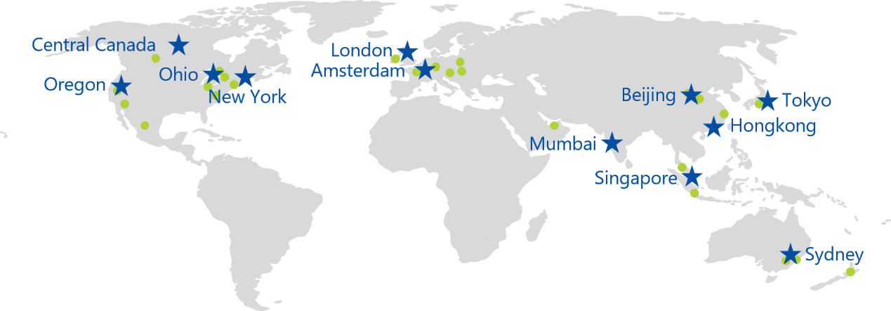
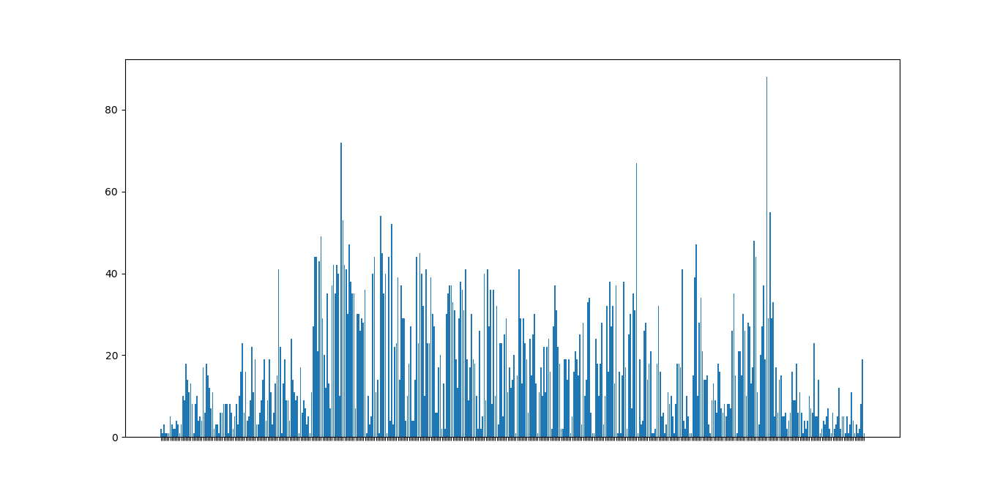

##  一、 概述
Zilliqa是第一个使用分片方案(Sharding)的公链平台，它尝试通过分片解决拓展性问题。Zilliqa出自于新加坡国立大学，原本是一个技术白皮书的研发项目，对白皮书的进一步调研与实验演化成了Zilliqa项目。

##  二、分析

### (一) 测试说明

我们在AWS上在全球部署了了若干个Kubernetes节点，用以模拟Zilliqa网络的环境，具体测试环境如下：

### (二) 共识

为了保证区块链的安全和分片的性能，Zilliqa采用工作量证明(PoW) ＋ 实用拜占庭容错算（PBFT）共识算法。

为了防范女巫攻击（恶意节点攻击）并解决节点分配到分片的机制等问题，Zilliqa采用PoW 机制。每个新的节点在进入Zilliqa首先进行工作量证明，并根据提交的哈希随机数分配到相应的分片上。

为了保证分片的安全，Zilliqa在每个分片内采用实际拜占庭容错(PBFT)。它假设有着一部分节点是怀有敌意，因此每个节点必须独立的验证所有交易，并且在所有节点中分享验证结果。 

在PBFT中，一个共识组中（即一个分片中）的所有节点按顺序排列，它有一个主节点（又名领导者），其他节点称为备份节点，每轮PBFT都有三个阶段，如下所述：

- 预准备阶段（Pre-prepare phase）：在这个阶段，领导者宣布其所在分片应达成一致的下一条记录，这是通过发送“预准备”消息完成的。
- 准备阶段：准备阶段（Prepare phase）：在收到预准备消息后，每个节点验证记录的正确性和有效性，并向所有其他节点组播“准备”消息。
- 提交阶段：提交阶段（Commit phase）：在收到来自绝对多数人的准备消息后，每个节点向该分片组播一个提交消息。最后，每个节点都等待来自绝对多数人的提交消息，以确保有足够数量的节点同意领导者提出的记录。

PBFT优点在于：

1. 它不是计算资源密集型的，比PoW耗能少
2. 效率更高，因为它可以利用一个小的共识组
3. 它不像基于PoW的共识机制，通常需要至少6个确认，pBFT的共识协议不会发生临时分叉，所以不需要确认，赋予了交易最终性。

PBFT缺点在于：

1. 通信复杂度过高，可拓展性比较低，一般的系统在达到100左右的节点个数时，性能下降非常快
2. PBFT在网络不稳定的情况下延迟很高

通过PoW+PBFT的搭配方式，在一定程度上可以在保证Zilliqa网络安全性、降低能耗的同时，还有效利用了Zilliqa的分片技术，在相对小的分组内达成共识，明显提升了网络效率。

### (三) 安全

通过Benchmark公链测试工具，对Zilliqa进行一系列安全测试，包括DDos攻击、长程攻击、短程攻击、网络分裂攻击等，我们的测试方法如下:

1.  建立Zilliqa测试网；

2.  发送RPC，让测试网部分节点对其他节点发起攻击；

3.  得到测试结果。

| 方案         | 结果   | 备注                                                                     |
|--------------|--------|--------------------------------------------------------------------------|
| DDoS攻击     | 不通过   | 以大量的通信量冲击网络，使得所有可用网络资源都被消耗殆尽                 |
| 长程攻击     | 不通过   | 攻击者创建了一条从创世区块开始的长区块链分支，并试图替换掉当前的合法主链 |
| 短程攻击     | 通过   | 攻击者篡改最近几个区块的数据                                             |
| 网络分裂攻击 | 不通过 | 把网络分成两个或多个部分，使得在较小的链上进行的任何重复交易都将丢失     |

从DDos攻击测试结果可知，攻击者可以向全部或51％的Zilliqa节点发送DDoS攻击，Zilliqa网络不能正常使用。

从长程攻击测试结果可知，攻击者可以创建了一条从创世区块开始的长区块链分支，并换掉当前的合法主链。

从短程攻击测试结果可知，攻击者无法篡改Zilliqa网络最近几个区块的数据，以替换掉当前的合法主链。

从网络分裂攻击测试结果可知，在发生网络分裂攻击后，在网络恢复正常之前，在较小的链上进行的任何重复交易都将丢失。

### (四) 性能

通过Benchmark公链测试工具，对Zilliqa进行性能测试，我们的测试方法如下：

1.  建立Zilliqa单分片的测试网；

2.  发送RPC，让测试网部分节点发起交易（每秒N笔交易，线性增长）；

3.  节点检测交易同步的时间，直到检测到超过一定时间（一般是出块时间）。

| 方案         | TPS | 备注                              |
|--------------|-----|-----------------------------------|
| 理想网络情况 | 412   | 单机虚拟机网络，无限网络连接      |
| 正常网络情况 | 122   | 分布全球的100个节点，正常网络连接 |
| 恶劣网络情况 | 11   |   |

按照理想网络情况下，Zilliqa性能达到500TPS，Zilliqa采用分片技术，理论上只需要可以通过增加分片，提高TPS。

### (五) 技术创新

Zilliqa带来的突破性的技术是其他区块链项目没有达到的分片技术。分片的概念源自于分布式数据库，但是在Zilliqa之前从未把分片技术引入公有区块链中。分片的思想是把网络中的节点分成一个更小的集合或更小的委员会(被称作碎片)，以此来平行的处理交易。每一个Shard碎片有它自己的迷你区块并且和其他碎片并行处理交易直至最终结果完成。

除此之外，Zilliqa也创新型地采用工作量证明(PoW) ＋ 实用拜占庭容错算（PBFT）共识算法。采用PoW 机制解决防范女巫攻击（恶意节点攻击）并解决节点分配到分片的机制等问题，采用PBFT机制保证分片的安全。

同时，Zilliqa也包含智能合约，智能合约层将使用Scilla语言，一种类似Solidary的语言。Scilla语言让开发者更加容易开发并且把应用从以太迁移至Zilliqa。

### (六) 代码

1.  代码概况

Zilliqa的主要Github仓库的具体数据如下:

| repository      | commit | watch | star | fork | issue |
|-----------------|--------|-------|------|------|-------|
|Zilliqa|7358|122|818|181|63|
|scilla|921|25|120|36|58|
|Zilliqa-JavaScript-Library|526|16|53|23|2|
|nucleus-wallet|159|11|5|3|0|
|savant-ide|255|8|14|9|10|

2.  代码更新

根据Zilliqa的Zilliqa的Github commits数据，得到Zilliqa的代码更新情况，如下:

3.  代码重复

###  (七) 经济模型

Zilliqa经济模型和以太坊类似，ZIL是Zilliqa的token，用于支付交易的费用和运行智能合约。

- 发行机制
代币总量210亿，目前已发行126亿，剩余84亿将通过挖矿产生；不增发
40%挖矿奖励将随着时间的推移在10年内递减（前4年挖约80%，后6年挖约20%）
- 代币分配
40%用于挖矿，30%用于社区公售，团队、顾问、早期开发人员各占：5%、3%、12%，剩余的10%用于安全性投入。

##  总结

Zilliqa采用为网络分片技术、POW+PBFT共识机制和智能合约语言Scilla，为高吞吐量的应用程序提供运行平台的新一代公链，技术亮点突出。有一定创新，但应用场景不明确。 