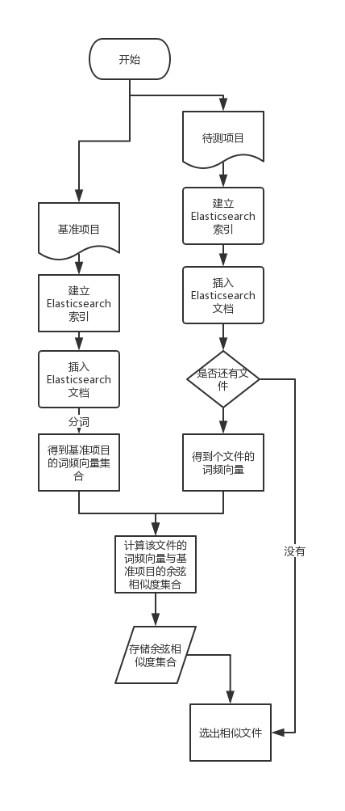
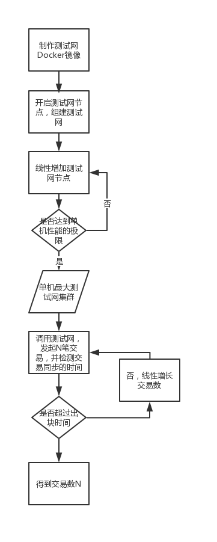

## actual combat part
### Code repeatability calculation
1. Actual combat:
- Get the word frequency vector set of the benchmark item and the item to be tested
- Calculate the cosine similarity set of each word frequency vector of the item to be tested and the reference item
- Select similar files

2. Learning materials
- ~~[Full Text Search Engine Elasticsearch Getting Started Tutorial] (http://www.ruanyifeng.com/blog/2017/08/elasticsearch.html)~~
- [Application of TF-IDF and cosine similarity (1): automatic extraction of keywords] (http://www.ruanyifeng.com/blog/2013/03/tf-idf.html)
- [Application of TF-IDF and cosine similarity (2): Find similar articles] (http://www.ruanyifeng.com/blog/2013/03/cosine_similarity.html)

### Performance Testing
1. Actual combat:
- Deploy a single-machine maximum Ethereum cluster and initiate transactions and detect when the transaction is synchronized.
- The number of linear growth transactions.
- Check if the transaction sync time exceeds the block time.

2. References
- [Geth builds an Ethereum private network] (http://ibloodline.com/articles/2018/02/02/geth.html)
- [Use Go to interact with the Ethereum blockchain] (https://medium.com/taipei-ethereum-meetup/use-go-interact with the Ethereum blockchain -a4a6cee256f2)

### Safety test
Learning materials
