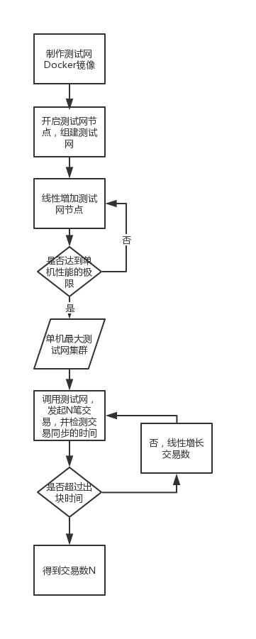

## 实战部分
### 代码重复度计算
1. 实战:
- 得到基准项目和待测项目的词频向量集合
- 计算待测项目的每个词频向量与基准项目的余弦相似度集合
- 选出相似文件

2. 学习资料
- ~~[全文搜索引擎 Elasticsearch 入门教程](http://www.ruanyifeng.com/blog/2017/08/elasticsearch.html)~~
- [TF-IDF与余弦相似性的应用(一):自动提取关键词](http://www.ruanyifeng.com/blog/2013/03/tf-idf.html)
- [TF-IDF与余弦相似性的应用(二):找出相似文章](http://www.ruanyifeng.com/blog/2013/03/cosine_similarity.html)

### 性能测试
1. 实战:
- 部署单机最大以太坊集群，并发起交易，并检测交易同步的时间。
- 线性增长交易数。
- 检测交易同步的时间是否超过出块时间。

2. 参考资料
- [Geth 搭建以太坊私有网络](http://ibloodline.com/articles/2018/02/02/geth.html)
- [使用Go与以太坊区块链进行互动](https://medium.com/taipei-ethereum-meetup/使用-go-與以太坊區塊鏈互動-a4a6cee256f2)

### 安全测试
1. 学习资料
