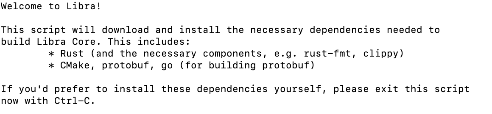
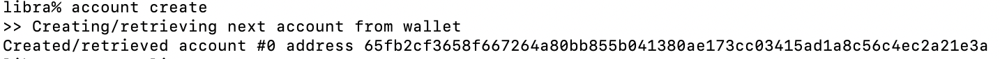
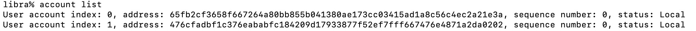
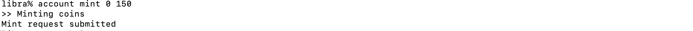
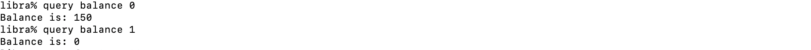
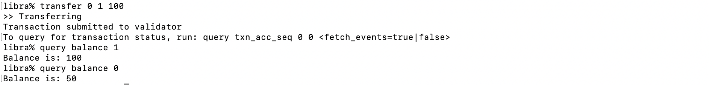

## 如何开启Libra测试网

Libra是Facebook主导的一个新的区块链和智能合约平台，Libra希望建立一套简单的、无国界的货币和为数十亿人服务的金融基础设施。Libra还非常早期，充斥着炒作和打鸡血，因此我们暂时不在这里讨论其未来价值。

Libra是一种区块链，也是一种加密数字货币。Move是Libra智能合约的编程语言，使用Rust语言开发。Rust语言是一个安全、实用、并发的现代语言。由于Libra目标是为数十亿人提供金融服务，因此Move的设计是以安全性为最高优先级。

Libra开源了部分代码，我们可以研究一下Libra的测试网。

### 准备

- Linux或者macOS
- 安装`git`
- 如果你是Linux，需要有`yum`或`apt-get`
- 如果你是macOS，需要安装Homebrew 

### 下载源码

```shell
git clone https://github.com/libra/libra.git
```

### 安装Libra 

为了安装Libra，你需要切换到libra目录，并运行安装脚本以安装依赖，如下：

```shell
cd libra
./scripts/dev_setup.sh
```

安装脚本会执行以下操作:

- 安装`rustup`。它是Rust的安装程序，Libra Core正是基于其中实现的。
- 安装Rust依赖`rust-toolchain`。
- 安装`CMake`。它一个跨平台的编译工具。
- 安装`protoc`。它是protocol buffers的编译器。
- 安装Go，它是用以构建protocol buffers。



### 构建Libra CLI ，并连接测试网

构建Libra CLI ，并连接到Libra测试网的验证者节点，如下，

```shell
./scripts/cli/start_cli_testnet.sh
```
一旦连接到测试网，你可以看到以下输出。同时，你也用`ctrl+C`结束进程。如果你看到输出了"connected to the validator"，那么你就设置成功。


### 创建钱包账户

注意一下，使用CLI创建钱包账户不会更新区块链，只会创建本地密钥对。

为了创建新的钱包账号，需要输入，

```rust
libra% account create
```

如果一切顺利，我们可以得到一个公开的钱包地址，`#0`是我们的账号的索引，而十六进制的字符串是我们的账号的地址。



为了转账到其他钱包，我们也需要创建另一个钱包账号。

同时我们也通过`account list`查看所有钱包地址。



### 加钱到钱包

我们可以通过 `account mint 0 150`，其中 `0`是钱包账号的索引， `150`是我们加到钱包账户的libra数量。



### 查询钱包的余额

我们可以通过`query balance 0`查询钱包的余额，其中 `0`是钱包账号的索引。



### 转账到其他钱包

为了将10 libra转账从`#0`钱包转账到`#1`钱包，

```rust
libra% transfer 0 1 100
```
检查一下`#1`和`#0`钱包的余额。



### 总结


### 参考文献

[1]<https://libra.org/en-US/white-paper/>

[2]<https://levelup.gitconnected.com/getting-started-with-the-facebook-libra-programming-language-a1d21aa837e0>


